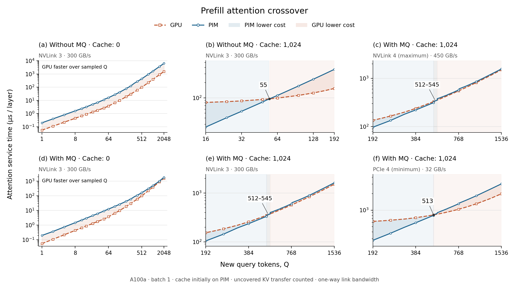

# Experiment 1 — KV 复用与 MQ 的 Prefill Attention 交叉边界

**Prefill Attention Crossover with KV Reuse and MQ**。回答：普通 PIM / MQ PIM 与 GPU 的交点在哪里，为什么会交叉，每条曲线究竟计入了什么。

[六联图 PDF](figures/Fugue-asplos-experiment1-prefill-crossover.pdf) · [PNG](figures/Fugue-asplos-experiment1-prefill-crossover.png) · [结果表](tables/Fugue-asplos-experiment1-summary.md) · [英文 caption](Fugue-asplos-experiment1-caption.txt) · [论文文字草稿](Fugue-asplos-experiment1-paper-text.txt)



### 交点在哪里

| 位置 | 配置 | 单向 B（GB/s） | 交点 Q / 反复切换范围 |
| --- | --- | --- | --- |
| a | 普通 PIM，C=0 | 300 | 无交点；所有采样 Q 均为 GPU 更快 |
| b | 普通 PIM，C=1024 | 300 | 55 |
| c | MQ PIM，C=1024 | 450 | 512–545（反复交叉） |
| d | MQ PIM，C=0 | 300 | 无交点；所有采样 Q 均为 GPU 更快 |
| e | MQ PIM，C=1024 | 300 | 512–545（反复交叉） |
| f | MQ PIM，C=1024 | 32 | 513 |

完整数据均扫描 Q=1–2048；主图对 C=1024 普通 PIM 聚焦 Q=16–192，对三个 MQ 交叉图聚焦 Q=192–1536，C=0 的两幅保持完整范围，纵轴是**单层、所有 heads 的 attention 服务延迟（µs）**。左右顺序与图中的 a–f 相同。普通 PIM 在 Q=54 时为 94.397 µs，GPU 为 95.546 µs；到 Q=55，普通 PIM 为 96.162 µs，GPU 为 95.928 µs，所以数字 55 是相邻整数确认的切换值，不是插值得到的小数交点。

MQ 在 300 / 450 GB/s 时存在 **512–545 Q 的反复切换区**。每个整数 Q=513–559 都已补测：Q=512 时 MQ 更快，513 开始出现 GPU 更快的点，之后因尾组和离散扫描时序数次改变胜者；从 545 起直到 2048 的后续采样点均为 GPU 更快。不能把粗采样曾得到的 544–552 当成唯一交点。图中只标区域，完整的每次切换及两端延迟保存在 [crossings.csv](tables/Fugue-asplos-experiment1-crossings.csv)。区域不是统计误差或拟合置信区间。

C=0 的两幅在所有采样点均为 GPU 更快，**没有可标出的交点**。这些结果只覆盖已测范围，不把有限采样称为对所有 Q 的证明。

### Latency 分别包含什么

输入条件：GPU 已产生本轮 Q 和新 K/V；历史 C 个 token 的 KV **初始只驻留 PIM**。服务完成时 attention 输出在 GPU，新 K/V 已写到 PIM。双方共有的 QKV projection、RoPE、输出 projection、FFN、请求排队及其它 transformer 层不计入这里。因此这不是 TTFT、TBT 或 E2E。

| 路径 | 按本实验计入的组成 | 重叠关系 |
| --- | --- | --- |
| GPU | GPU QK + 独立 softmax + GPU PV；历史 K/V 从 PIM 回读；新 K/V 写回 PIM 的暴露部分 | 历史 KV 回读与 GPU attention 串行；新 KV 写出允许与这两项重叠，两方向独立 |
| 普通 PIM | Q 输入；Q 次单 query scan；独立 PIM softmax；新 KV 的暴露传输；O 返回 | Q 必须先到；新 KV 只与第一组旧 cache 扫描重叠；O 完成后返回 |
| MQ PIM | Q 输入；每组最多 8 Q 的 scan；独立 PIM softmax；新 KV 的暴露传输；O 返回 | 同一传输规则，只有 scan 的 query grouping 改变 |

PIM scan 已含 QK/PV 的 MAC、片内 buffer 搬移、SFM 命令、ACT/PRE/刷新及等待。QK 与 PV 已合并在原版 scan 中，**不能再额外加一次 PV**。这里沿用第一步的独立 PIM softmax 项，未使用原版 decode pipeline 将该项置零；SFM 命令时序仍留在 trace 中。这是当前统一的计价口径，并不表示已经验证了完整数值 softmax 的执行微架构。

没有人为添加的固定链路启动延迟。一个 token 的 Q/O 各为 32 heads × 128 × 2 bytes = 8192 bytes；新 K/V 为 16384 bytes。Q=51 时，**Q 输入和 O 返回各 1.39264 µs**，是 51×8192 / 300 GB/s 的结果，不是固定 1.39 µs。随着 Q 增加，这两项线性增长。

```text
N = C + Q
T_Q = T_O = Q × 8192 / B
T_newKV = Q × 16384 / B
T_fetch = C × 16384 / B

T_PIM = T_Q + T_scan + T_PIM_softmax + max(0, T_newKV − W) + T_O
T_GPU = max(T_GPU_QK + T_GPU_softmax + T_GPU_PV + T_fetch, T_newKV)
```

B 是**单向** bytes/s，公式单位为秒；CSV 转为 µs。W 来自原版逐 channel 命令时间戳：扫描开始至第一条消费新 K 的 MAC 之前；取第一组可用窗口，不累加后续 Q 组。C=0 时取 W=0。新 KV 只有 `min(T_newKV,W)` 被隐藏，余下部分必须计时。

**例子：C=1024、Q=200、B=300 GB/s。** 新 KV 传输共 10.923 µs，第一组可重叠窗口只有 1.100 µs，因此暴露 9.823 µs；GPU 路径可隐藏其新 KV 写出。这里没有把整段新 KV 传输无条件删掉。

| 组成（C=1024，Q=200） | GPU（µs） | MQ PIM（µs） |
| --- | --- | --- |
| GPU QK | 32.377 | — |
| GPU softmax | 37.117 | — |
| GPU PV | 32.377 | — |
| 历史 KV 回读 | 55.924 | 0 |
| Q 输入 | 0 | 5.461 |
| PIM scan（已含 QK/PV） | — | 76.881 |
| 独立 PIM softmax | — | 11.685 |
| 新 KV 未被隐藏的部分 | 0.000 | 9.823 |
| O 返回 | 0 | 5.461 |
| 服务总延迟 | 157.794 | 109.311 |

MQ 合计 `5.461 + 76.881 + 11.685 + 9.823 + 5.461 = 109.311 µs`；GPU 合计 `32.377 + 37.117 + 32.377 + 55.924 = 157.794 µs`。总计节省 48.483 µs（30.73%，1.444×）。其中 scan/算子部分节省约 **13.304 µs**，暴露传输部分节省约 **35.178 µs**；不能将这 30.73% 全部归因于 MQ 计算加速。所有未四舍五入的数据在 [components.csv](tables/Fugue-asplos-experiment1-components.csv)。

### 为什么有交点，为什么 cache 和 link 会影响交点

1. **小 Q 且 cache 已在 PIM 时，GPU 有历史 KV 回读成本。** C=1024 时单层回读 16 MiB，需要 55.924 µs；这项对同一个 C 不随 Q 增长。PIM 就地扫描，避免这次历史 KV 传输。C=0 时该优势消失，新 KV 又没有旧 cache 扫描可以遮蔽，因而冷 prefill 不能沿用同一个阈值。
2. **普通 PIM 的扫描次数随 Q 增长；MQ 只能在每组最多 8 Q 内复用。** 普通 scan 约为 Q×单 query scan，MQ 为各 full / tail 组 scan 之和。Q 增大时总扫描、query-private movement 和 softmax 都增加。GPU 使用原版矩阵 QK/PV 模型，因此两条服务成本曲线的斜率不同；交点是完整服务成本相等的位置，不是强制设置的 token 阈值。
3. **不是所有收益都来自 scan。** 本图的 GPU KV 回读、PIM Q/O 及暴露新 KV 传输并不随 C、Q 等比例增长。只有孤立 attention roofline 中的运算/读取比不足以预测这个服务成本交点。这里 cache 初始位置和重叠规则直接参与比较。
4. **带宽对双方都有作用，不能说越大就必然越偏向某一方。** 在新 KV 未被完全隐藏、GPU 新 KV 写出已隐藏的区域，令 d=8192 bytes/token，成本差可写为：

```text
T_PIM − T_GPU
= T_scan + T_PIM_softmax − T_GPU_attention − W
  + (2d / B) × (2Q − C)
```

这解释了为什么 C=1024、Q=512 时，链路项在成本差中抵消：不同带宽下 MQ 比 GPU 都少约 **17.443 µs**，虽然两者的绝对延迟不同。Q<C/2 时低带宽对 GPU 回读惩罚更大；Q>C/2 时低带宽对 PIM 的输入/输出及新 KV 更不利。该式只适用于上述 max 分支，完整计算一直使用原公式。

### 为什么 MQ 在 512–545 不是一个干净的交点

这不是随机噪声；仿真是确定的离散时序。**8-query 分组尾部与 DRAM 扫描粒度**共同形成小台阶，而交点附近两条曲线很接近。

- Q=512、C=1024 时 N=1536，64 个完整组，每组 scan=3.743492 µs，总 scan=239.583488 µs。
- Q=513 时 N=1537，64 个完整组加一个 1-query 尾组。每个完整组 scan 变成 4.013411 µs，尾组 2.283930 µs，总 scan=259.142234 µs。scan 一次增加 **19.558746 µs**，而 GPU 服务成本只增加约 **0.765 µs**，所以此处反转。
- 原始命令记录中，N=1536→1537 的 full-group trace MACAB 从 2688 增至 2716，MVSB 从 3584 增至 4032，MVGB 从 2688 增至 3136，且实际记录出现 REFab。并非只增加一个等价的 MAC；不能用平滑比例替代这段原版时序。
- 同一组内后续 Q 增加会改变尾组效率，使很接近的两条曲线再次交换胜者。Q=544→545 时也同时跨越 scan 粒度并增加尾组；完整组 scan 从 4.024177 增至 4.402525 µs，进一步使 GPU 获胜。

[transition-evidence.csv](tables/Fugue-asplos-experiment1-transition-evidence.csv) 保存原始 timing 路径、哈希和实际命令计数；[crossings.csv](tables/Fugue-asplos-experiment1-crossings.csv) 保存每次换边两侧成本。没有为了单交点而平滑或删除数据。

## 共用模型、范围与复现记录

- 原版 commit `c60005143a6b492d7ef83231723386478b59a506`；`main.py`、`src/`、PIM trace generator 和 Ramulator 源码未修改。原版顶层 prefill 固定在 GPU，这里通过独立实验 driver 组合原版算子/scan 来比较 PIM prefill；MQ 是明确加入的时序模型扩展。
- 原版 LLAMA-7B，32 layers、hidden=4096、32 heads、head dimension=128、FP16、batch=1；1 个原版 A100a、5 HBM、bank-level PIM、功率约束。报告单层所有 heads，不能再除以 head 数。原版 A100a 是仓库中的算力/内存参数组合，不是硬件实测配置。
- 工作量为完整 Q×(C+Q) 矩形，沿用原版成本方式，不按因果三角形折减。GPU 为原版独立 QK/softmax/PV，未替换 FlashAttention；它的 head/SM 利用率模型也保留。
- MQ 每 bank 512 B buffer，每个 query slice 64 B，最多 8 Q；tCK=0.769 ns（约 1.3 GHz），满组 nCCDAB=8 tCK。1–8 Q 的间隔为 6/7/7/7/7/8/8/8 tCK；保留 query-private 命令次数及尾组成本。
- 原始 X2G 传输按总接口带宽的一半计价；32–450 GB/s 是原版接口预设的单向极限，当前敏感性不更换 GPU。端点 KV 存取、GPU 历史 KV 分块回读与 attention 的重叠未另行建模；PIM 的传输暴露项是解析式等待，未把链路等待插回 Ramulator 重算刷新调度。这些是本图的服务模型条件。

完整最终数据：[全部曲线](tables/Fugue-asplos-experiment1-latency.csv)、[接口预设](tables/Fugue-asplos-experiment1-bandwidth.csv)、[每次交点](tables/Fugue-asplos-experiment1-crossings.csv)、[分项](tables/Fugue-asplos-experiment1-components.csv)。所有采样点仍在最终 CSV 中；主图仅保留最后的聚焦窗口版本。旧版全范围图和历史脚本已移出 Fugue-paper。

## 独立复现本实验

本目录只保留最终版图和数据。旧图/旧脚本已归档到本地 output，不是复现依赖；完整最终 CSV 与主图聚焦 CSV 是同一份最终数据的不同视图。原始实验说明及不利结果保留在上文。

在仓库根目录安装依赖后运行（如尚未构建，先执行 build）：

```bash
python3 -m fugue build --jobs 8
python3 -m fugue run --experiments 1,2 --jobs 8
python3 -m fugue plot --experiments 1,2
python3 -m fugue verify --experiments 1,2
```

也可直接使用 `python3 -m fugue all --jobs 8` 从头复现所有实验。已成功的相同阶段可用 `--resume`；失败重试使用新的 `--output`。新 trace、YAML、逐 channel 命令、时间/能量事件和日志生成在 `output/Fugue-asplos-reproduce/`，不依赖历史 output。只重画本目录图表使用 `python3 -m fugue plot --from-paper --experiments 1,2`。

[完整复现指南](../../docs/Fugue-asplos-reproduction.md) · [模型范围](../../docs/Fugue-asplos-methodology.md) · [固定输入与来源](../../artifact/inputs/README.md) · [当前来源记录](provenance/Fugue-asplos-current.json)。
