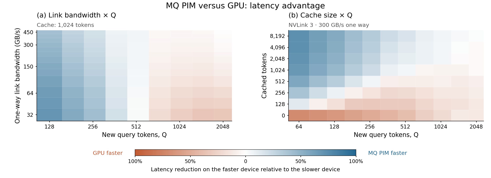

# Experiment 2 — MQ Attention 的链路带宽 / KV Cache 敏感性

用两张并排热图展示 MQ PIM 与 GPU 的服务延迟优势：左图固定 cache=1024，扫描 link×Q；右图固定 NVLink 3（单向 300 GB/s），扫描 cache×Q。

[主图 PDF](figures/Fugue-asplos-experiment2-mq-sensitivity.pdf) · [PNG](figures/Fugue-asplos-experiment2-mq-sensitivity.png) · [模型与成本分项](../Fugue-asplos-experiment-1-prefill-attention-crossover/README.md)



## 展示范围与完整数据

- 左图聚焦 Q=128–2048，带宽仍为 32–450 GB/s，展示 117 个既有网格点。按实际图轴面积计算，MQ 占优区约 57.4%，GPU 区约 42.6%。
- 右图聚焦 Q=64–2048，保留 C=0、128、256、512、1024、2048、4096、8192 全部 cache 档位，展示 88 个既有网格点。MQ/GPU 占优区域约 53.4% / 46.6%。
- 只改变主图窗口；没有改变延迟、颜色归一化或胜者。所有 Q=1–2048 最终采样数据仍在本目录；图只保留最后的聚焦版本。这些面积是绘图窗口的几何比例，**不是 workload 命中率、概率或系统总体胜率**。
- Q 和 link 使用对数坐标；cache 行为标出的离散测试值，等距排列以包含 C=0。每个格子对应实际评估点，不进行颜色平滑或边界插值。

## 颜色如何解读

蓝色为 MQ 更快，橙色为 GPU 更快，白色为相等；两图共享 `D=(T_GPU−T_MQ)/max(T_GPU,T_MQ)` 的 [-1,1] 标尺。绝对值是较快一方相对较慢一方的延迟降低：50%=2×，75%=4×。两侧同样深浅代表同等相对优势。没有为了扩大某一颜色而单独拉伸色标。

数据均为原版 A100a、LLAMA-7B、batch=1、单层 attention 服务成本。历史 KV 初始在 PIM，GPU 回读、Q/O 传输及未隐藏的新 KV 均按实验 1 的规则计时。MQ 约 1.3 GHz，满 8 Q 为 8 tCK。

## 趋势与边界

增大缓存一般扩展本条件下 MQ 更快的 Q 区间；低带宽同时影响 GPU 历史 KV 回读与 PIM 输入/输出，不是单方面惩罚某一设备。C=1024 的精确补测转换区为 512–545；热图是较粗网格，不用格间边界覆盖实验 1 的整数补测结论。C=0 的这一测试范围内始终 GPU 更快，C=8192 范围内始终 MQ 更快，两行如实保留。

[完整 link×Q CSV](tables/Fugue-asplos-experiment2-link-Q.csv)、[完整 cache×Q CSV](tables/Fugue-asplos-experiment2-cache-Q.csv)、[主图左格 CSV](tables/Fugue-asplos-experiment2-link-Q-focused.csv)、[主图右格 CSV](tables/Fugue-asplos-experiment2-cache-Q-focused.csv)。形状和全部算子成本在 [shapes.csv](tables/Fugue-asplos-experiment2-shapes.csv)。

完整复现现在直接仿真实验 1/2 的最终形状集合；link 敏感性仅重新计算传输公式，不做请求数外推。

绘图参考 piPE-SA 的绘图方式 的离散 pcolormesh、并排切片和定量色条；不复用其数据。论文可用 [caption](Fugue-asplos-experiment2-caption.txt) 与 [文字草稿](Fugue-asplos-experiment2-paper-text.txt)。

## 独立复现本实验

本目录只保留最终版图和数据。旧图/旧脚本已归档到本地 output，不是复现依赖；完整最终 CSV 与主图聚焦 CSV 是同一份最终数据的不同视图。原始实验说明及不利结果保留在上文。

在仓库根目录安装依赖后运行（如尚未构建，先执行 build）：

```bash
python3 -m fugue build --jobs 8
python3 -m fugue run --experiments 1,2 --jobs 8
python3 -m fugue plot --experiments 1,2
python3 -m fugue verify --experiments 1,2
```

也可直接使用 `python3 -m fugue all --jobs 8` 从头复现所有实验。已成功的相同阶段可用 `--resume`；失败重试使用新的 `--output`。新 trace、YAML、逐 channel 命令、时间/能量事件和日志生成在 `output/Fugue-asplos-reproduce/`，不依赖历史 output。只重画本目录图表使用 `python3 -m fugue plot --from-paper --experiments 1,2`。

[完整复现指南](../../docs/Fugue-asplos-reproduction.md) · [模型范围](../../docs/Fugue-asplos-methodology.md) · [固定输入与来源](../../artifact/inputs/README.md) · [当前来源记录](provenance/Fugue-asplos-current.json)。
