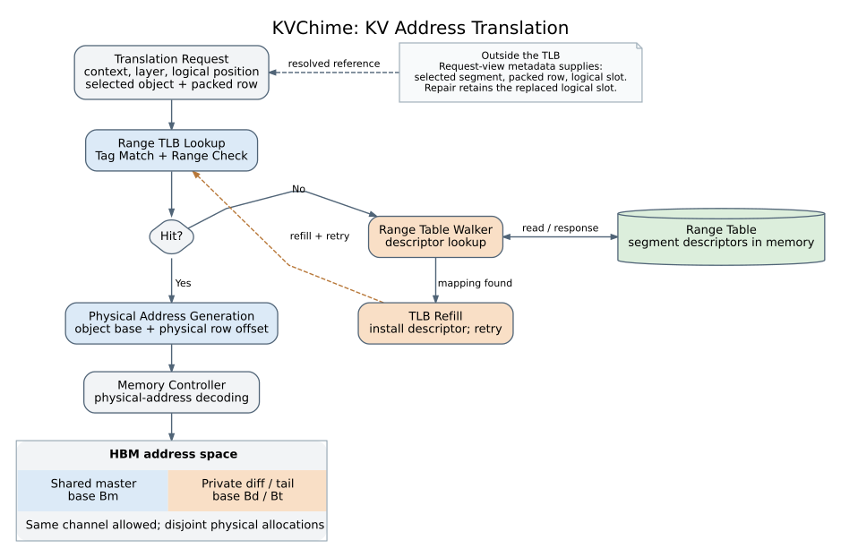
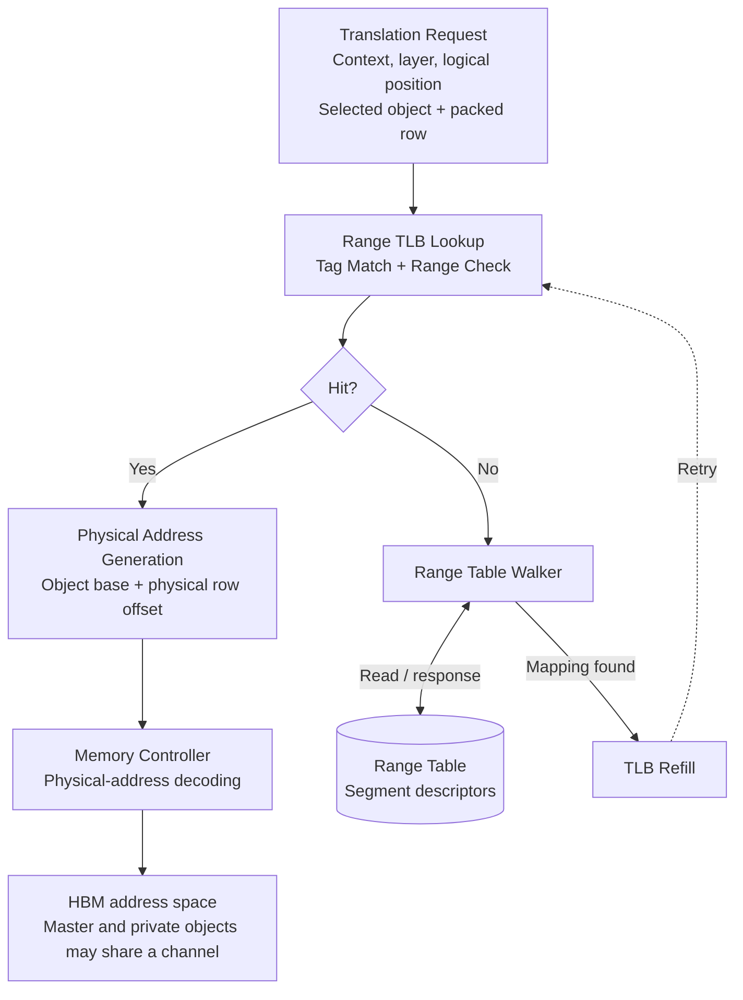

# KVChime TLB 与 Dᵢ map 流程图

全部图保存在 **`/data2/chenyi9/KV-PIM/attacc-fugue/KVChime-TLB-flow/`**。

| 图 | SVG | PDF | 可编辑源码 |
| --- | --- | --- | --- |
| TLB 微架构 | [tlb_flow.svg](tlb_flow.svg) | [tlb_flow.pdf](tlb_flow.pdf) | [tlb_flow.dot](tlb_flow.dot) |
| Dᵢ map 微架构 | [di_map_flow.svg](di_map_flow.svg) | [di_map_flow.pdf](di_map_flow.pdf) | [di_map_flow.dot](di_map_flow.dot) |
| 两者连接与 attention 阶段总图 | [tlb_di_overview.svg](tlb_di_overview.svg) | [tlb_di_overview.pdf](tlb_di_overview.pdf) | [tlb_di_overview.dot](tlb_di_overview.dot) |

[Dᵢ map 的公式、文献、接口和实现边界](di_map_notes.md)。使用 `python3 render.py` 可重新生成全部三组矢量图。

这版按 2026-09-08 的论文逻辑绘制：**master 和 private diff/tail 使用不同物理 allocation，可以位于同一 channel；replacement 保留被替换项的逻辑位置。** 图中没有 master channel / diff channel 的固定分区。



[矢量 SVG](tlb_flow.svg) · [矢量 PDF](tlb_flow.pdf) · [可编辑 Graphviz 源码](tlb_flow.dot)

## 图的含义

请求视图先确定应访问的 segment 与 packed row，再进入 TLB。命中时取得对应物理 base，计算物理地址；未命中时读取 descriptor table，回填并重试。实际 channel/bank/row/column 由物理地址决定，数据的 shared/private 身份不预先决定 channel。

图中的粗粒度流程是：



只画正常映射存在时的 miss 路径；查不到合法映射时需要返回错误，而不是无条件回填。为了让草稿简洁，fault、attach、flush 和访问调度不展开为额外框。

## 各步骤名称的文献依据

这些名称对应已有的硬件功能。文献支持术语和基本操作；图的组合、KV descriptor 字段及 replacement 语义是 KVChime 的具体设计，不能据此声称与引用系统实现相同。

| 图中名称 | 文献中的对应内容 | 在 KVChime 中的含义 |
| --- | --- | --- |
| Translation Request | RMM §4.1 的地址翻译请求与 lookup | 上游已解析出对象/segment 与 row；不是原始 CPU 虚拟地址 |
| Range TLB Lookup；Tag Match + Range Check；Hit? | RMM §4.1、Fig. 3 的范围翻译缓存、范围比较、命中判断；§4.3 讨论上下文标识 | 匹配请求对应的 descriptor，并检查该 segment 的范围；保留请求视图隔离 |
| Range Table Walker；Range Table | RMM Table 3、§4.2–4.3 的明确名称 | 从内存 descriptor 表找到缺失段的元数据 |
| TLB Refill | RMM §4.3 描述将找到的映射装入缓存，§7 使用 range TLB refill 一词 | 填入 descriptor 后重试；这里不暗示无限容量或零代价 |
| Physical Address Generation | Direct Segments §3.1、Fig. 2 通过 base/limit/offset 进行地址转换；这里用通用操作名称概括 | 对选定对象的物理 base 加合法物理 row offset；不把它画成 CPU 中通常在 TLB 前生成虚拟地址的 AGU |
| Memory Controller | GPGPU-Sim ISPASS 2009 §2.1、Fig. 1 的 memory controller 与地址解码 | 按原生物理映射解码 channel/bank/row/column，服务 master 和 private 地址 |

RMM 的区间缓存/查表术语见 [Karakostas et al., *Redundant Memory Mappings for Fast Access to Large Memories*, ISCA 2015](https://www.cs.utexas.edu/~mckinley/papers/rmm-isca-2015.pdf)。本文使用“范围缓存命中、查描述符和回填”的术语，没有移植 RMM 的冗余分页、B-tree 或操作系统策略。

物理地址的 base/offset 转换机制见 [Basu et al., *Efficient Virtual Memory for Big Memory Servers*, ISCA 2013, §3.1](https://research.cs.wisc.edu/multifacet/papers/isca13_direct_segment.pdf)。KVChime 中 token/row offset 必须先按实际布局转换为字节地址，不能直接把逻辑 token 下标当字节 offset。

controller 与地址解码术语见 [Bakhoda et al., *Analyzing CUDA Workloads Using a Detailed GPU Simulator*, ISPASS 2009, §2.1](https://www.microsoft.com/en-us/research/wp-content/uploads/2017/02/gpgpusim.ispass09-2.pdf)。此处只采用通用块名称，不采用该文的 GPU/DRAM 具体几何。

## 为什么这里用 Range Table Walker

当前 `kvpim-rtl/rtl/kv_ptw.sv` 的文件名使用 PTW，但实际读的是目录与 segment descriptor 数组。用于论文框图时，**Range Table Walker 比普通 Page Table Walker 更贴合查区间描述符的职责**。这是对本地设计的命名判断；RMM 提供了已经发表的同名结构。

RMM 的 walker 遍历其 range table，当前 RTL 使用 directory + descriptor 数组搜索，两者的数据结构不同。不要因为用了同一个框名，就把 RMM 的全部具体机制移进 KVChime。

## diff 的位置应该怎么解释

必须分别保留三个量：

| 量 | 含义 |
| --- | --- |
| Logical slot | consumer attention 中的位置，replacement 继承原位置；它控制 causal mask 和 score/probability 对应关系 |
| Packed row | 选定 private object 内的存储序号；稀疏 replacement 的 packed row 通常不等于原 logical slot |
| Physical address | 对象 base 加依据原生布局生成的物理 offset；它决定实际 channel/bank/row/column |

例如 private replacement 替换逻辑位置 `t`，它可以紧凑地存于 private object 的第 `j` 行：

```text
logical slot t ──request-view map──> (private object, packed row j)
                                             |
                                      segment translation
                                             |
                                Bd + native_layout_offset(j)
```

master 对应项和 private replacement 的地址不同；两者的 channel 分量可以相同。用于注意力的 logical slot 仍是 `t`，不能因 private 存在第 `j` 行就将其 RoPE/causal 位置也改成 `j`。

`native_layout_offset` 在这里只是表达原生映射的数学占位，不是新增硬件模块名称。图中不引入旧 RTL 的固定 256 B stride、K/V 固定间距或 channel 专用池作为当前论文的通用约束。

## TLB 与 replacement map 的边界

**稀疏 logical slot → packed row 的解析放在 TLB 外。** 当前论文按 request-view metadata 维护选定版本及地址关系；旧 `diff_decoder.sv` 的 prefix-popcount 是 compact score 位置恢复的一种已有实现，不应直接画成 TLB 内部的地址转换器。

本图从已经解析的 selected reference 开始，不新增或假定一种必须使用的 bitmap 编码。逻辑位置、replacement 有效性和 query reference shift 仍由对应视图/执行元数据保留；RoPE 对齐不在 TLB 内完成。

## 论文与 RTL 的对应范围

这是一张供论文讨论的 translation-cache 微架构草稿。依据当前论文 `sections/04-design.tex` 的 logical view 和 disjoint base allocation 描述，以及 `fig/diagrams/compact-view-translation/README.md` 对稀疏 row 映射的边界说明。

本地组件对应为 `kv_seg_tlb.sv` 的范围比较和 descriptor 缓存、`kv_ptw.sv` 的 descriptor walk、`kv_tlb_top.sv` 的接口。当前 RTL 的 diff 扫描仍依赖 attach 后驻留的 descriptor；图中为论文表达的通用 miss/refill 结构，不能当作任意 diff miss 已在现有顶层实现的证明。

当前论文的时序模型没有计入 translation-cache hit/miss/walk 开销；这张图也不增加任何时延、命中率或性能结论。访问排序和连续 run 合并属于外部 scan/request 调度，未混入这张 TLB 核心流程。

## 复现

从本文件所在目录执行，只需要 Graphviz：

```bash
dot -Tsvg tlb_flow.dot -o tlb_flow.svg
dot -Tpdf tlb_flow.dot -o tlb_flow.pdf
```

建议论文图注：

> KVChime resolves selected KV references through a range-based translation cache. Missing descriptors are fetched and cached before translation resumes. Shared and private objects occupy disjoint physical allocations and may reside in the same channel. Sparse replacement indexing is resolved by request-view metadata outside the TLB.
