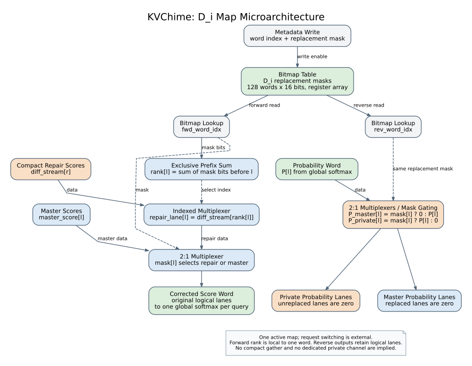

# Dᵢ map：微架构与 TLB 接口



[Dᵢ map PDF](di_map_flow.pdf) · [源码](di_map_flow.dot) · [TLB 与 Dᵢ map 总图](tlb_di_overview.svg)

Dᵢ 表示请求 i 的私有 replacement 位置集合；这里将它画成 bitmap 表及其读取、索引和选择逻辑。**Dᵢ 决定一个逻辑位置使用哪个版本、对应哪个 compact row；TLB 解析所选段的物理地址。** private diff/tail 与 master 可以位于同一 channel，彼此占据不同物理 allocation。

这张图采用现有 `diff_decoder.sv` 的 bitmap 实现展示微架构；当前论文的 request-view descriptor 不被限制为必须使用这一种编码。

## 1. 实际 RTL 的 mask 表

正式 channel wrapper 将 decoder 配为 16 个 FP32 lanes、128 个 score words。因此 mask 表是 `128 × 16 bit = 256 B` 的寄存器数组。`meta_wr_en / meta_wr_idx / meta_wr_mask` 写入；forward 和 reverse 分别用自己的 word index 读同一张表。

图上使用 `Bitmap Table` 和 `Bitmap Lookup`，不称其为 KV cache，也不画成带 context tag 的多请求 SRAM。现有 RTL 的表只有 word 维度；请求 i 是当前被装载的视图。切换请求、保证前向和反向使用相同版本的 metadata 是外部控制责任。

## 2. 前向：rank 与两级选择

设 `M[l]` 是当前 word 的第 l 个 replacement bit，1 表示使用私有 replacement。首先计算：

```text
rank[l] = sum(M[j] for 0 <= j < l)
```

这是不包含当前位置的前缀求和，图中标 `Exclusive Prefix Sum`。例如：

```text
M        = [0, 1, 0, 1]
rank     = [0, 0, 1, 1]
compact  = [r1, r3]
master   = [s0, s1, s2, s3]
selected = [s0, r1, s2, r3]
```

随后是两个不同作用的 MUX：

1. `Indexed Multiplexer`：根据 `rank[l]` 从当前 word 对应的 compact repair score 段中选取一项。
2. `2:1 Multiplexer`：根据 `M[l]`，选择 repair score 或 master score。

输出保持原 logical lanes。并不是将 master 与 diff 相加，也不是先把 repair 追加到末尾。完成 replacement、tail 和 causal 有效性处理后，全部有效 score 属于该 query 的同一个 softmax 域。

## 3. 反向：同一 mask 控制概率去向

global softmax 返回逻辑顺序下的概率 `P[l]`。当前 RTL 的两组选择逻辑为：

```text
P_master[l]  = M[l] ? 0    : P[l]
P_private[l] = M[l] ? P[l] : 0
```

图中标 `2:1 Multiplexers / Mask Gating`。这是选择原始概率位串或全零，不是 FP 乘法。因此 NaN 等特殊浮点值也不会被错误理解为通过乘零来屏蔽。

两个输出仍保持 logical lane 编号；当前源码没有将 private 概率进一步 gather 成 compact vector。匹配 packed V 的消费顺序必须由后续接口保持，图中没有新增一个已经实现的 gather 单元。

## 4. Dᵢ map 怎样接到 TLB

总图中的 `Multiplexer + Offset Addition` 是请求视图的地址接口，采用虚线框表示；它不是声称现有 `diff_decoder` 已经输出物理地址。

对于原共享区间中的逻辑位置 `p = word_base + l`：

```text
M[l] = 0:
  object = shared object
  row    = p - consumer segment start

M[l] = 1:
  object = private object
  row    = compact_word_offset + rank[l]
```

`compact_word_offset` 是当前 word 在该 private object 中的起始 row，由对象/word metadata 或外围扫描状态提供。**单个 word 的 rank 不能直接冒充整个 private object 的全局 row。** 当前 `diff_decoder` 不存这个 offset；它假设 forward compact score 输入已经是当前 word 对应的段。

private tail 由上游视图以新的逻辑位置和对应 private row 直接给出，走 private-reference 选择支路，不伪装为某个旧位置上的 replacement。当前软件可将 replacement 与 tail 一起存入同一个 private object。

TLB 接收选定的 object/segment 与 row 关系，返回物理 descriptor，再按原生布局生成地址。QK 和 PV 使用同一版本、同一 row 对应关系；只将 K 换成其匹配的 V。

这说明为什么有两块结构：**Dᵢ map 管逻辑版本及稀疏顺序，TLB 管物理地址翻译。** 物理地址最终解码成哪个 channel，不能由 `M[l]` 直接决定。

## 5. 名称依据

| 名称 | 采用原因与来源 |
| --- | --- |
| Exclusive Prefix Sum / Prescan | 计算当前位置之前的元素和；Blelloch 明确定义 prescan，并讨论用前缀结果产生压缩/重排索引 |
| Multiplexer / MUX | 通用选择电路；Bit-Tactical 展示使用 metadata 控制多路选择器完成稀疏数据配对。这里只借用电路名称，未采用其 weight scheduling |
| Bitmap Table / Bitmap Lookup | 按位记录成员关系的 metadata 存储与读取；在本图中的实际依据是 `diff_mask[NWORDS]` 数组与 word-index 读出 |
| Mask Gating | 描述本地 RTL 的按 mask 选概率/零操作；物理实现可表达为普通 2:1 MUX，不是另一个声称由某篇论文提出的专用单元 |
| Range TLB / Range Table Walker / TLB Refill | 沿用 [TLB 图的文献核对](README.md)，而不是为 KVChime 发明新的查表模块名称 |

前缀操作的定义与应用见 [Blelloch, *Prefix Sums and Their Applications*, §1.1–1.3](https://www.cs.cmu.edu/~guyb/papers/Ble93.pdf)。文中叫 prescan 的操作排除当前元素，和这里的 rank 公式一致；本文不把其 PRAM 实现拓扑当作本地综合网表。

metadata 控制 MUX 的稀疏数据选择实例见 [Bit-Tactical, 2018 preprint, §4](https://arxiv.org/pdf/1803.03688)。这个引用支持通用选择电路的命名，不是对 KVChime replacement 或概率分路正确性的外部验证。

所有块使用普通存储、前缀求和、多路选择、门控、地址生成等功能名称。Dᵢ 的 KV replacement 语义由本设计定义；不把它伪装成已有论文里完全相同的单元。

## 6. 源码依据与图的范围

- `/data2/chenyi9/KV-PIM/kvpim-rtl/rtl/diff_decoder.sv`：`diff_mask`、`rank`、forward MUX、reverse mask gating。
- `/data2/chenyi9/KV-PIM/kvpim-rtl/rtl/diff_decoder_channel_dc_top.sv`：16-lane、FP32、128-word 参数。
- `/data2/chenyi9/KV-PIM/kvpim-rtl/rtl/fugue_pkg.sv`：`SM_WORDS=128`。
- `/data2/chenyi9/KV-PIM/attacc-fugue/fugue/kvchime.py` 的 `view()`：私有位置排序、共享旧位置无效、private object 的逻辑位置记录。

只读源码并生成图，没有运行模型、数值实验、RTL 仿真或综合。Dᵢ 位图单元是已有组件的微架构图；跨 word offset、请求切换、TLB miss 对接与完整 QK/softmax/PV 闭环通过文字和虚线框保留实现边界。

## 7. 全部图的完整路径

```text
/data2/chenyi9/KV-PIM/attacc-fugue/KVChime-TLB-flow/tlb_flow.svg
/data2/chenyi9/KV-PIM/attacc-fugue/KVChime-TLB-flow/tlb_flow.pdf
/data2/chenyi9/KV-PIM/attacc-fugue/KVChime-TLB-flow/di_map_flow.svg
/data2/chenyi9/KV-PIM/attacc-fugue/KVChime-TLB-flow/di_map_flow.pdf
/data2/chenyi9/KV-PIM/attacc-fugue/KVChime-TLB-flow/tlb_di_overview.svg
/data2/chenyi9/KV-PIM/attacc-fugue/KVChime-TLB-flow/tlb_di_overview.pdf
```

对应 `.dot` 是可编辑源码。使用 `python3 render.py` 可重新生成三组 SVG/PDF；无需联网或额外 Python 库，只需要 Graphviz 的 `dot` 命令。
