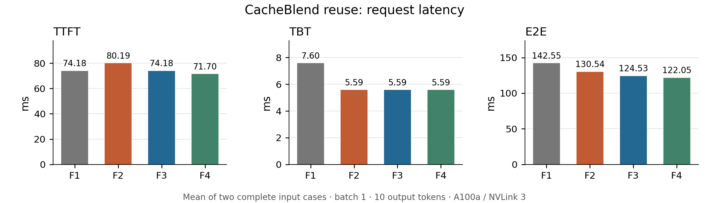
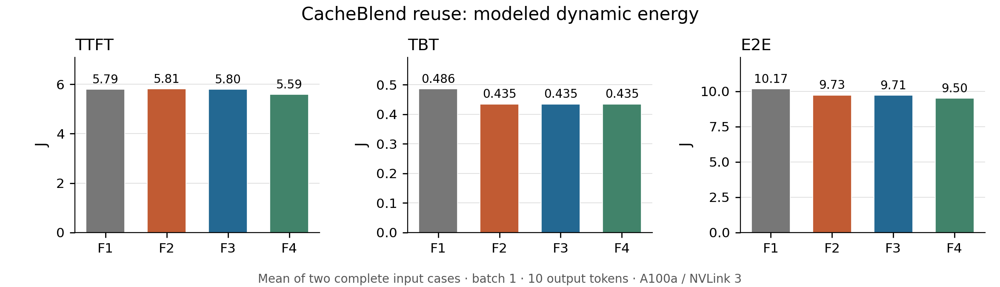
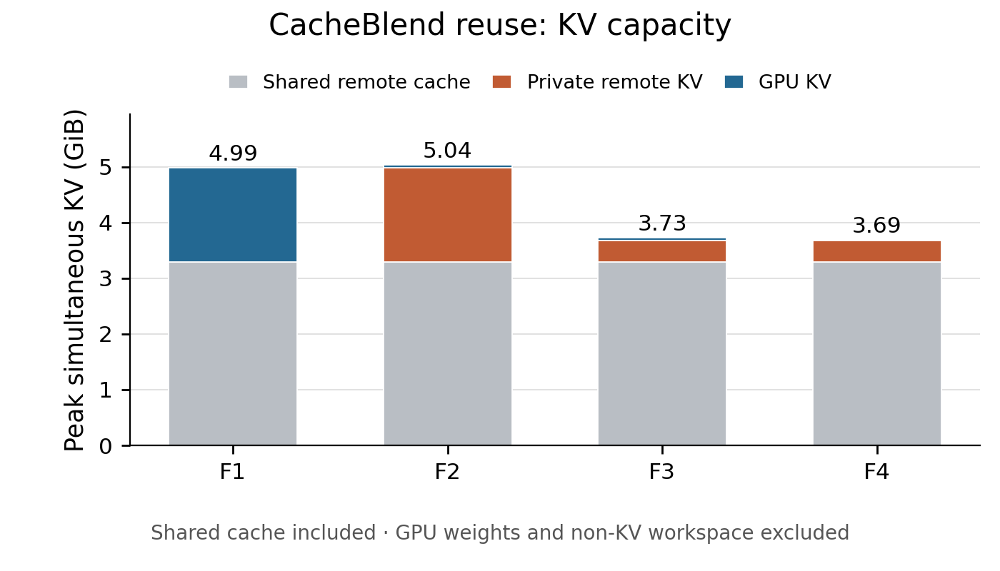

# Experiment 3 — CacheBlend 小输入的复用、容量、时延与能耗

在原版 AttAcc 算子 / PIM scan 上回放两个完整 CacheBlend 小输入，比较 **F1 远端缓存、F2 完整 KV 物化、F3 仅保存新版本、F4 动态 prefill 选边**。本实验不改变 placement、地址映射或 row/channel 布局。

[容量图 PDF](figures/Fugue-asplos-experiment3-capacity.pdf) · [延迟图 PDF](figures/Fugue-asplos-experiment3-latency.pdf) · [能耗图 PDF](figures/Fugue-asplos-experiment3-energy.pdf) · [逐请求完整结果](tables/Fugue-asplos-summary.csv) · [汇总 CSV](tables/Fugue-asplos-aggregate.csv)

## Workload 的来源与行为

从 `software/CacheBlend/inputs/1.json..10.json` 中，按原版 LLAMA tokenizer 的完整 prompt 长度排序，选最短的 **3.json 和 2.json**。选样只看长度，没有按性能收益选样；每个输入包含 5 段真实示例文档和一个问题，未截断、补长或复制文档。两请求顺序运行，batch=1，无 request 外推。

| 请求 | 来源 | 文档数 | 逐文档 token | 旧 cache C₀ | 新 suffix | N | 部分 query Q |
| --- | --- | --- | --- | --- | --- | --- | --- |
| Fugue-asplos-request-01 | inputs/3.json | 5 | 605, 713, 656, 677, 707 | 3362 | 58 | 3420 | 595 |
| Fugue-asplos-request-02 | inputs/2.json | 5 | 661, 660, 719, 646, 707 | 3397 | 61 | 3458 | 604 |

原示例采用 Mistral tokenizer；本实验把原文重新用本地 LLAMA tokenizer 编码，以匹配原版 AttAcc 的 LLAMA-7B 配置。prompt 由 BOS、`[INST]`、5 个文档 chunk、问题、`[/INST]` 组成。每请求输出固定为示例的 10-token 上限，所以 TTFT 产生第一个输出后还有 9 次 decode。这是**形状 / 成本回放**，没有运行数值 LLM 推理，也不把这 10 token 当成实测答案长度。

先把每个独立文档 chunk 的 KV 放进远端 HBM，形成所有方案共有的只读 cache pool。相同前缀只保存一份；两个输入的 10 个文档加公共前缀，共 11 个唯一对象、6755 个 token。预热结束后再计在线 TTFT/E2E；预热成本也单独报告，不消失。

软件层数策略来自 `check_layers=[1]`、`recomp_ratio=0.16`：

- 第 0 层：完整 QKV、完整 attention、完整后续算子，保存 N 个新 K/V。
- 第 1 层：完整 QKV，选择 `floor(0.16×C₀)+suffix` 个 query，再执行部分 attention / projection / FFN。原代码 `status=1` 不把未选 K/V 换回旧版本，因此该层仍有 N 个新 K/V；不能错误地只存 16%。比较旧 V 的链路读取对所有方案都计入。
- 第 2–31 层：只重算选中的 Q 个 token，attention 仍读取全部 N 个逻辑 K/V。新版本覆盖旧位置，**N 不因 diff 再增加一遍**。

这里回放选中 token 的数量，未运行模型相关的 top-k 判断或验证答案质量；原版 AttAcc 也没有 top-k、RoPE、embedding、LM head 或 host 调度算子，它们未计入下面的模型 E2E。原始文本、逐段 token IDs、选样列表及软件源码哈希全部保存。

## F1–F4 究竟差在哪里

| 方案 | 软件复用 | prefill attention | decode attention | 远端 HBM 保存什么 |
| --- | --- | --- | --- | --- |
| F1 | 相同 CacheBlend 重算策略 | GPU | GPU | 只保存公共 chunk cache；当前完整 KV 保留在 GPU HBM |
| F2 | 同上 | GPU | 原版 PIM | 公共 cache + 每请求完整物化 KV，沿用原版 prefill 完整 KV 写出顺序 |
| F3 | 同上 | 固定 GPU | 原版 PIM | 公共 cache + 本请求 recompute/new KV 版本；无改动部分只引用旧版本 |
| F4 | 同上 | 按每层完整服务成本选 GPU / MQ PIM | 原版 PIM | 与 F3 相同 |

F3 的“只存 diff”是避免重复物化 / 存储未改动旧 K/V，**不是免除 GPU attention 对历史 KV 的读取**。后 30 层 GPU 仍须回读 N−Q 个未改动旧 token 的 K/V，再与新 Q 个 token 合并做 QK/PV。读写采用原版 X2G 带宽、能量参数；不加入布局改善、row conflict 缓解或 scan 加速。

F2/F3/F4 在 decode 时访问同样的逻辑 N，故复用同一份原版单 query Ramulator scan，并执行原版 `System.simulate(..., pipe=False)` 的 decode 流水规则；因此 TBT 和 TBT energy 相同。F1 的 decode 则留在 GPU。

### 动态选边怎么算

F4 使用实验 1 / 2 的成本项，代入每层真实的 Q、N、已有 KV 驻留位置及更新字节数，比较绝对服务时间，**不使用固定的“200 token”阈值**。第 1 层的 attention Q 小于新 K/V 数 N，传输必须按 N 计价；后 30 层才是 Q 个新版本。

由于 CacheBlend 的 recompute 位置分散，不能套用实验 1 连续旧前缀的长 overlap 窗口。本次保守取 W=0；计入 Q 输入、全部新 KV 传输、scan、独立 PIM softmax 和 O 返回。GPU 候选按 `max(GPU attention + 必需旧KV回读, 新KV写出)` 计时。选择目标是 latency，不保证能量也逐点最小。

| 请求 | 层 | Q | 新/重算 KV 数 | 未改动旧 KV 数 | GPU候选 µs | MQ候选 µs | 选择 |
| --- | --- | --- | --- | --- | --- | --- | --- |
| Fugue-asplos-request-01 | 0 | 3420 | 3420 | 0 | 4364.628 | 4769.219 | GPU |
| Fugue-asplos-request-01 | 1 | 595 | 3420 | 0 | 759.343 | 986.681 | GPU |
| Fugue-asplos-request-01 | 2 | 595 | 595 | 2825 | 913.626 | 832.398 | PIM |
| Fugue-asplos-request-02 | 0 | 3458 | 3458 | 0 | 4462.159 | 4862.133 | GPU |
| Fugue-asplos-request-02 | 1 | 604 | 3458 | 0 | 779.394 | 1006.654 | GPU |
| Fugue-asplos-request-02 | 2 | 604 | 604 | 2854 | 935.260 | 850.787 | PIM |

两个输入都选择前 2 层 GPU、后 30 层 MQ PIM。全 64 个层决策、两端时间和能量在 [decisions.csv](tables/Fugue-asplos-decisions.csv)。

## 指标和结果

TTFT 是在线请求进入本模型至第一输出 token 的完整 32 层 prefill 成本；TBT 是后续 9 次 decode 的平均完整模型成本；`E2E = TTFT + 9×TBT`。三种 energy 使用相同范围，`E2E energy = TTFT energy + 9×TBT energy`。延迟 / 能量表是两个输入的算术平均，不是吞吐外推或样本统计置信区间。

| 方案 | TTFT ms | TBT ms/token | E2E ms |
| --- | --- | --- | --- |
| F1 | 74.182 | 7.597 | 142.552 |
| F2 | 80.192 | 5.594 | 130.542 |
| F3 | 74.182 | 5.594 | 124.532 |
| F4 | 71.696 | 5.594 | 122.046 |



| 方案 | TTFT energy J | TBT energy J/token | E2E energy J |
| --- | --- | --- | --- |
| F1 | 5.7933 | 0.4859 | 10.1662 |
| F2 | 5.8121 | 0.4349 | 9.7261 |
| F3 | 5.7976 | 0.4349 | 9.7116 |
| F4 | 5.5873 | 0.4349 | 9.5013 |



能耗来自原版 GPU/PIM `get_time_and_energy`：原始单位 pJ，`pJ / 10⁹ = mJ`。MQ 按共享后的真实 trace 统计内存流量，query-private 搬移及计算仍随 query 数增长。decode latency/energy 与原版顶层逐 token 加总核对。链路重叠只隐藏时间，所有传输仍计能量。这些是**原版动态能耗估计，不是板卡功率测量**；原版 X2G 只计链路能量，未额外建模 DMA 两端访问或静态功耗。原版 PIM 算术能耗仍沿用合并 score 的既有计价，没有另添 PV 计数修正。

### 容量口径

容量表取两个输入运行期间的峰值。远端容量包含公共只读 pool 和当前请求私有 KV，GPU KV 包含 F1 的完整活动 cache，或其它方案逐层 GPU KV buffer。权重使用原版 `get_required_mem_capacity`，所有方案均相同，为 12.000 GiB；GPU 总量列另外包含原版临时区。容量是 tensor payload，不含 allocator metadata、碎片或新增 placement 数据结构。

| 方案 | 远端 KV 峰值 GiB | GPU KV 峰值 GiB | 同时总 KV 峰值 GiB | GPU 含权重/临时区峰值 GiB |
| --- | --- | --- | --- | --- |
| F1 | 3.2983 | 1.6929 | 4.9912 | 13.6934 |
| F2 | 4.9912 | 0.0528 | 5.0396 | 12.0533 |
| F3 | 3.6848 | 0.0528 | 3.7331 | 12.0533 |
| F4 | 3.6848 | 0.0528 | 3.6896 | 12.0533 |



F3/F4 保存的远端 KV 对象完全相同。容量图还包含 GPU 的逐层 KV buffer：F4 后 30 层在 PIM 上执行，GPU 不再需要同时物化整层旧 KV，所以同时总 KV 峰值可以略小。这是临时工作集差异，不是额外的共享或布局收益。

容量图使用**同一时刻的** GPU+远端 KV 峰值，堆叠公共 cache、私有远端 KV 和 GPU KV；没有把不同时刻的独立峰值相加。各峰值时刻在 [capacity-peaks.csv](tables/Fugue-asplos-capacity-peaks.csv)，全过程在 [storage.csv](tables/Fugue-asplos-storage.csv)。

每请求保存量（不含公共 pool）：F2 为 `32×(N+9)×16384 bytes`；F3/F4 为 `(2×N+30×Q+32×9)×16384 bytes`。首两层完整 K/V、后续 diff 和 9 个 decode token 均计入。请求完成后释放私有版本，原文 chunk cache 保留；两个请求不假装并发占用显存。

## 收益从哪里来，哪些没有改善

- F1→F2：attention decode 移到 PIM，TBT 降低 **26.36%**，但完整物化使 TTFT 增加；两者都如实保留。
- F2→F3：远端 KV 总峰值降低 **26.18%**；只看每请求私有 KV，降低 **77.17%**。后一个数值不包含公共 cache，不能冒充系统总容量节省。主表 TTFT 降低 **7.49%**，TBT 不变。
- F3→F4：TTFT 降低 **3.35%**，在线 E2E 降低 **2.00%**；TTFT energy 降低 **3.63%**，E2E energy 降低 **2.17%**。远端持久 KV 容量、TBT 及 TBT energy 相同。共同 GPU projection / FFN 仍占较大成本，所以不能把局部 attention 收益等比例当作 E2E 收益。

### F2 写出时序的敏感性，必须一起看

F2 按原版 prefill 的 QKV→完整 KV 写出→GPU attention 顺序收费；F3/F4 沿用实验 1/2 中新 diff 写出与 GPU attention / 回读重叠的规则。因此 F2→F3 的 TTFT 收益同时受到**完整物化写出以及原版串行写出时序**影响，不能全部声称为减少字节的独立收益。

我们另做了不改变主基线的解析式诊断：若 F2 在取回旧 KV、完成物化之后，也允许完整 KV 写出与 GPU attention 重叠，本例 GPU attention 足以隐藏写出，其 TTFT 会接近 F3。容量、传输字节和能耗仍保留 F2 的完整物化成本。

| 请求 | F2 原版写出 TTFT ms | F2 允许写出重叠 ms | F3 TTFT ms |
| --- | --- | --- | --- |
| Fugue-asplos-request-01 | 79.516 | 73.539 | 73.539 |
| Fugue-asplos-request-02 | 80.867 | 74.824 | 74.824 |

[敏感性 CSV](tables/Fugue-asplos-F2-export-overlap-sensitivity.csv) 保留计算结果；它不是新增的 F5，也没有悄悄替换主表 F2。

## 预热成本与完整一次运行

公共 cache 的一次原版 GPU 构建和写入合计 **470.312 ms、47.315 J**，所有方案相同。在线结果假设 cache 已准备好；如果只运行这两个请求并把预热也摊进来：

| 方案 | 预热 + 两请求总时间 ms | 预热 + 两请求动态能耗 J |
| --- | --- | --- |
| F1 | 755.416 | 67.647 |
| F2 | 731.396 | 66.767 |
| F3 | 719.375 | 66.738 |
| F4 | 714.404 | 66.317 |

这说明小规模演示中的预热并不免费。每个 chunk 的构建成本见 [warmup.csv](tables/Fugue-asplos-warmup.csv)。

## 可核查的最终数据

[workload](workload/Fugue-asplos-workload.json)、[token IDs](workload/Fugue-asplos-token-ids.json)、[事件](tables/Fugue-asplos-events.csv)、[算子](tables/Fugue-asplos-operators.csv)、[传输](tables/Fugue-asplos-transfers.csv) 和 [容量快照](tables/Fugue-asplos-storage.csv) 保留最终版本。

## 独立复现本实验

本目录只保留最终版图和数据。旧图/旧脚本已归档到本地 output，不是复现依赖；完整最终 CSV 与主图聚焦 CSV 是同一份最终数据的不同视图。原始实验说明及不利结果保留在上文。

在仓库根目录安装依赖后运行（如尚未构建，先执行 build）：

```bash
python3 -m fugue build --jobs 8
python3 -m fugue run --experiments 3 --jobs 8
python3 -m fugue plot --experiments 3
python3 -m fugue verify --experiments 3
```

也可直接使用 `python3 -m fugue all --jobs 8` 从头复现所有实验。已成功的相同阶段可用 `--resume`；失败重试使用新的 `--output`。新 trace、YAML、逐 channel 命令、时间/能量事件和日志生成在 `output/Fugue-asplos-reproduce/`，不依赖历史 output。只重画本目录图表使用 `python3 -m fugue plot --from-paper --experiments 3`。

[完整复现指南](../../../docs/Fugue-asplos-reproduction.md) · [模型范围](../../../docs/Fugue-asplos-methodology.md) · [固定输入与来源](../../inputs/README.md) · [当前来源记录](provenance/Fugue-asplos-current.json)。
