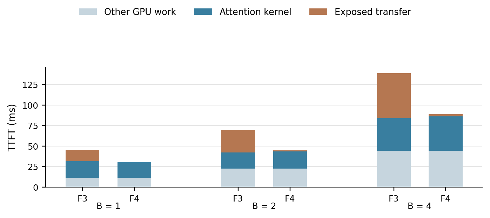
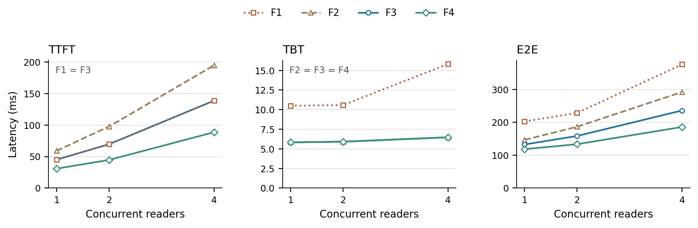
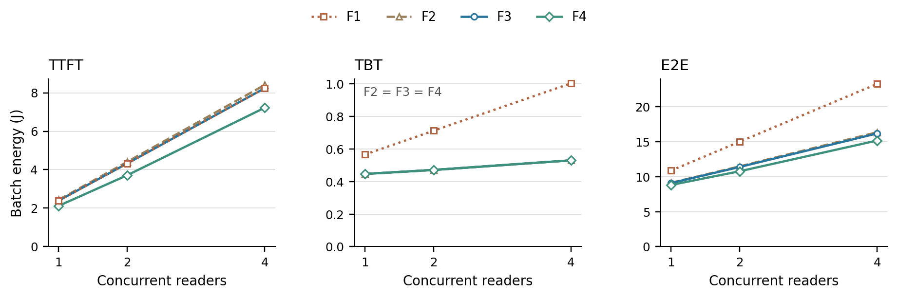
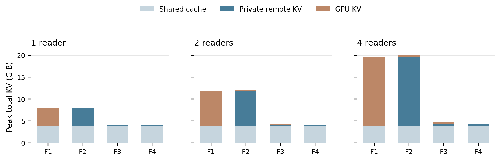

# Experiment 5：EPIC 文档上的并发 Reader 与 KV 共享

一句话：使用 EPIC 的真实长文本与 `kvlink-16` 规则，在本仓库 AttAcc 中直接回放较长上下文及同步共享访问，分开核算 attention 计算、传输和整模型成本。

## Workload 与执行位置

| case | 原始文档目标长度 | 文档块数 | 实际 N | 每个请求 Q | batch | 每 HBM 仿真 head 数 |
| --- | --- | --- | --- | --- | --- | --- |
| shared-readers-B1 | 8000 | 11 | 8035 | 188 | 1 | 7 |
| shared-readers-B2 | 8000 | 11 | 8035 | 188 | 2 | 13 |
| shared-readers-B4 | 8000 | 11 | 8035 | 188 | 4 | 26 |

EPIC 源码提交 `3204410f1723ed0f39575b4eba8c17578a1ee1a1`。执行其 `LongContext.generate_context`、`encode_and_trim`、`Data_set._split_docs` 和两个 prompt 构造方法：从本地 Paul Graham essays 按原仓库遍历顺序读入文本，按预先选定的 4000/8000/16000 token 档位截取，以默认 512 token 块向句号/换行边界延伸分块；不为制造收益填充 token 或构造地址冲突。保留每段 BOS，所以实际 N 略大于目标文档长度。选样档位在仿真之前记录。

这是从 EPIC 8K 文本构造的同步 reader fan-out，明确属于派生多 agent case，而非 EPIC 自带的多 agent 运行轨迹。Reader A/B/C/D 分别提出“Identify the main theme”，只用角色字母区分身份；四条问题等长，共享相同 system 和文档 KV，问题 chunk 各自独立。B=1、2、4 都在 t=0 同时到达，同批次 prefill 与 decode；没有排队到达、后续主 agent、跨轮依赖。

`kvlink-16` 的实际执行代码选每个文档开头 16 token，加上整个问题 token，去重得到 Q；所有 32 层均只为这些 token 产生 QKV、执行 Q×N attention、projection/FFN。系统块保留缓存。N 为原来完整 prompt 的长度，重计算是替换 N 中的部分位置，不是把 Q 再追加为 N+Q。上游 EPIC 在运行前分别缓存 system、文档和问题全部 chunk，这里保留该约定。每个请求对应的 token ID、重算位置、chunk hash 均在 [workload](workload/Fugue-asplos-workload.json)；原始文本与原始 token 分块也保留。

GPU/模型使用 **原版 A100a、LLAMA-7B、32 层、32 MHA head、FP16、5 HBM、NVLink 3 单向 300 GB/s**。为与实验 1–3 一致，使用本地 LLAMA tokenizer，未冒充 EPIC 默认 Llama-3.1-8B GQA 的模型/分词配置。长上下文只评估该形状的硬件成本，不验证原 LLAMA 模型在长位置上的数值可用性或回答质量。每请求固定 16 个输出 token，来自 EPIC `SamplingParams` 默认上限；真实 one-word/EOS 请求可能更早结束。

当前运行入口为仓库中的 `python3 -m fugue run --experiments 4,5`，实际导入同一仓库的 `src/`，Ramulator 从同一仓库捆绑源码构建。[来源与检查](provenance/Fugue-asplos-current.json) 保存模型和复现信息；原生 GPU、trace mapping 与 DRAM 模型保持不变。

## F1–F4 与 latency 包含什么

| 方案 | prefill | decode | KV 存储 |
| --- | --- | --- | --- |
| F1 | GPU | GPU | 远端 HBM 为不可变 chunk cache；GPU 保留本批所有层完整 active KV |
| F2 | GPU | 原版 PIM | 取回未重算部分，在原版 qkv→完整 KV 写出→attention 顺序中物化每请求完整 KV |
| F3 | 固定 GPU | 原版 PIM | 旧 chunk 引用共享，仅写入本请求重算/新生成版本；GPU attention 仍需读回未重算 KV |
| F4 | 比较完整 GPU 与 MQ PIM service，逐层选最短 | 原版 PIM | 与 F3 相同的远端共享与 diff 存储 |

设 G=GPU QK+softmax+PV，P=MQ native scan+原版独立 softmax 成本，R=未重算 KV 读回，D=新/重算 KV 写出，H=完整 N KV 写出，I/O=Q 输入和 attention 输出。每项都按实际 batch 的字节或算子维度计算：

- F1 service = G + R。
- F2 service = R + H + G，保留原版串行写出顺序。
- F3 service = max(G + R, D)，不同方向的 diff 导出可与 GPU 路径重叠。
- F4 service = min(F3 service, I + P + D + O)。本 workload 的更新散布于文档边界，保守设 KV overlap window W=0，没有套用连续旧前缀的扫描隐藏时间。

TTFT 对所有 32 层累加 **QKV→attention service→projection/FFN/norm**；TBT 为后续 15 个 decode step 的整模型平均；E2E=TTFT+15×TBT。第一输出 token 计入 prefill。所有 TTFT/TBT/E2E 都是整个批次的完成延迟，**不除以 batch**；能量表为整个批次，另有每请求能量和 throughput 列。生成步数 16 是统一 timing cap，E2E 不能解释为软件实际生成的答案长度。

MQ 为约 1.3 GHz、8 个 resident Q 对应 8 tCK，尾组按实际 r 设置间隔并计入独立 trace；普通 PIM 使用原版 r=1。MQ 只复用一个请求内部的 KV 扫描，不假设跨 reader 合并扫描。原生头数为 ceil(32×batch/5)，`fast_mode=False`；5 HBM 的对称建模沿用原 wrapper。F2/F3/F4 的 decode 使用真实单 Q trace，经原版 Ramulator wrapper 和原版 `System.simulate` 计算，TBT/energy 完全一致。

## 结果与 attention 是否暴露

| case | F4 TTFT 降低 | F4 E2E 降低 | F4 E2E 能量降低 | F3 远端容量降低（相对 F2） |
| --- | --- | --- | --- | --- |
| shared-readers-B1 | 31.64% | 10.75% | 3.00% | 48.78% |
| shared-readers-B2 | 35.91% | 15.79% | 5.38% | 64.99% |
| shared-readers-B4 | 36.11% | 21.25% | 6.27% | 77.94% |

上表延迟/能量降幅均为 F4 相对 F3；容量降幅单独比较 F3 与 F2。B=4 时，每个请求 Q=188、N=8035，PIM trace 真正包含每 HBM 26 个 head；B=1/2 分别为 7/13。B=2 的 GPU attention kernel 与 B=1 一样长，是原版利用率模型随 head 数提高的结果，未做手工除法。B=4 的 MQ kernel 比 GPU 略慢，但避免 1714.203 µs/层的旧 KV 读回，完整 prefill service 明显降低。多个 reader 的结果在同一个批次完成，没有建模 main agent 后续汇总。

| case | F3 纯 attention / TTFT | F3 attention service / TTFT | GPU kernel µs/层 | MQ kernel µs/层 | GPU 完整 service µs/层 | MQ 完整 service µs/层 | F4 选择 |
| --- | --- | --- | --- | --- | --- | --- | --- |
| shared-readers-B1 | 43.94% | 74.42% | 617.661 | 580.842 | 1046.212 | 601.377 | PIM |
| shared-readers-B2 | 28.40% | 67.82% | 617.661 | 652.885 | 1474.763 | 693.954 | PIM |
| shared-readers-B4 | 28.49% | 68.03% | 1235.322 | 1301.786 | 2949.526 | 1383.924 | PIM |

“纯 attention”是 QK/softmax/PV 核心执行时间，“attention service”还包含关键路径上暴露的读回/写出/Q/O 传输。两者不能混称。全部六个 case 中 F4 的 32 层都选择 PIM；这说明这些预声明 workload 位于 PIM 优势区，**本实验不声称展示 GPU↔PIM 来回切换**。GPU 优势区和交点仍由实验 1/2 提供。



| case | 方案 | TTFT ms | TBT ms | E2E ms |
| --- | --- | --- | --- | --- |
| shared-readers-B1 | F1 | 44.987 | 10.497 | 202.450 |
| shared-readers-B1 | F2 | 59.029 | 5.828 | 146.453 |
| shared-readers-B1 | F3 | 44.987 | 5.828 | 132.411 |
| shared-readers-B1 | F4 | 30.752 | 5.828 | 118.176 |
| shared-readers-B2 | F1 | 69.587 | 10.580 | 228.291 |
| shared-readers-B2 | F2 | 97.672 | 5.911 | 186.338 |
| shared-readers-B2 | F3 | 69.587 | 5.911 | 158.254 |
| shared-readers-B2 | F4 | 44.601 | 5.911 | 133.268 |
| shared-readers-B4 | F1 | 138.735 | 15.820 | 376.029 |
| shared-readers-B4 | F2 | 194.903 | 6.471 | 291.968 |
| shared-readers-B4 | F3 | 138.735 | 6.471 | 235.799 |
| shared-readers-B4 | F4 | 88.635 | 6.471 | 185.700 |



| case | 方案 | TTFT J | 每步 TBT J | E2E J |
| --- | --- | --- | --- | --- |
| shared-readers-B1 | F1 | 2.3903 | 0.5658 | 10.8773 |
| shared-readers-B1 | F2 | 2.4341 | 0.4467 | 9.1349 |
| shared-readers-B1 | F3 | 2.3913 | 0.4467 | 9.0921 |
| shared-readers-B1 | F4 | 2.1189 | 0.4467 | 8.8196 |
| shared-readers-B2 | F1 | 4.3271 | 0.7123 | 15.0116 |
| shared-readers-B2 | F2 | 4.4148 | 0.4712 | 11.4834 |
| shared-readers-B2 | F3 | 4.3292 | 0.4712 | 11.3978 |
| shared-readers-B2 | F4 | 3.7157 | 0.4712 | 10.7844 |
| shared-readers-B4 | F1 | 8.2367 | 1.0037 | 23.2918 |
| shared-readers-B4 | F2 | 8.4119 | 0.5303 | 16.3665 |
| shared-readers-B4 | F3 | 8.2408 | 0.5303 | 16.1954 |
| shared-readers-B4 | F4 | 7.2261 | 0.5303 | 15.1806 |



能量沿用原版动态 pJ 模型：pJ/10^12=J；事务重叠只减时间，不删除能量。原版 PIM score 的能量口径包含合并扫描的访存与原版 QK 算术项，没有额外修补 PV 算术能量；X2G 保留原版 link 能量，不添加端点 DMA 或静态板级功耗。结果是模型估计，非板卡实测。

## 容量、预热和公平性

| case | 方案 | 远端峰值 GiB | GPU KV 峰值 GiB | 同一时刻总 KV 峰值 GiB |
| --- | --- | --- | --- | --- |
| shared-readers-B1 | F1 | 3.923 | 3.931 | 7.854 |
| shared-readers-B1 | F2 | 7.854 | 0.123 | 7.969 |
| shared-readers-B1 | F3 | 4.022 | 0.123 | 4.138 |
| shared-readers-B1 | F4 | 4.022 | 0.003 | 4.022 |
| shared-readers-B2 | F1 | 3.929 | 7.861 | 11.791 |
| shared-readers-B2 | F2 | 11.791 | 0.245 | 12.021 |
| shared-readers-B2 | F3 | 4.127 | 0.245 | 4.358 |
| shared-readers-B2 | F4 | 4.127 | 0.006 | 4.127 |
| shared-readers-B4 | F1 | 3.941 | 15.723 | 19.664 |
| shared-readers-B4 | F2 | 19.664 | 0.490 | 20.125 |
| shared-readers-B4 | F3 | 4.337 | 0.490 | 4.799 |
| shared-readers-B4 | F4 | 4.337 | 0.011 | 4.337 |



不可变共享池按内容 hash 去重；F2 每请求额外存完整 N×32 层，F3/F4 每请求额外存 Q×32 层及 15 个 decode token。F1 的 active KV 留在 GPU。图中堆叠值来自同一个峰值时刻；独立 GPU 峰值和远端峰值另列，不把不同时刻的峰值相加。容量图不包括共同 GPU 权重；[summary](tables/Fugue-asplos-summary.csv) 同时给出原版权重、临时空间和 GPU 总需求，所有 case 均小于原版 80 GiB。引用表、allocator 碎片和数值 RoPE 转换开销未建模。

| case | 预热 ms | F4 在线 E2E ms | 预热 + F4 E2E ms | 预热 + F4 E2E J |
| --- | --- | --- | --- | --- |
| shared-readers-B1 | 569.210 | 118.176 | 687.386 | 65.147 |
| shared-readers-B2 | 575.247 | 133.268 | 708.515 | 67.602 |
| shared-readers-B4 | 587.320 | 185.700 | 773.020 | 72.978 |

在线表假设 cache 预热完成，上表显式计入每 case 独立的公共 warmup；这几个 case 是独立实验，不能把不同 case 的缓存池累计。预热逐 chunk 的 token、时间、能量在 [warmup](tables/Fugue-asplos-warmup.csv)。

F2→F3 的主表延迟收益同时包含完整写出字节减少和写出调度改变。为避免混淆，[F2 export-overlap sensitivity](tables/Fugue-asplos-F2-export-overlap-sensitivity.csv) 保留 F2 完整写出字节、容量和能量，仅允许其写出在取回后与 GPU attention 重叠：R+max(H,G)。当 G 足以隐藏完整写出时，该敏感性 TTFT 与 F3 一致；当 H 更长时仍留下写出差额。逐 case 的精确值见该表，不能把 F2→F3 主表的 TTFT 差全部称为纯存储节省。F3→F4 在同一服务模型下比较，独立于这个差异。

共享存储、引用和流量是实验账本；底层扫描继续采用原生每请求逻辑视图，未实现把不同请求的地址物理别名到同一 bank 的 allocator。因此本实验覆盖实际 batched head 数带来的通道/命令压力，**不声称测量了共享物理地址的热点冲突或跨请求合并读收益**。没有引入新 placement。

## 可核查的最终数据

[scan 表](tables/Fugue-asplos-scan.csv)、[完整 summary](tables/Fugue-asplos-summary.csv)、[选边成本](tables/Fugue-asplos-decisions.csv)、[事件](tables/Fugue-asplos-events.csv)、[算子](tables/Fugue-asplos-operators.csv) 和 [传输](tables/Fugue-asplos-transfers.csv) 保留最终版本。

## 独立复现本实验

本目录只保留最终版图和数据。旧图/旧脚本已归档到本地 output，不是复现依赖；完整最终 CSV 与主图聚焦 CSV 是同一份最终数据的不同视图。原始实验说明及不利结果保留在上文。

在仓库根目录安装依赖后运行（如尚未构建，先执行 build）：

```bash
python3 -m fugue build --jobs 8
python3 -m fugue run --experiments 4,5 --jobs 8
python3 -m fugue plot --experiments 4,5
python3 -m fugue verify --experiments 4,5
```

也可直接使用 `python3 -m fugue all --jobs 8` 从头复现所有实验。已成功的相同阶段可用 `--resume`；失败重试使用新的 `--output`。新 trace、YAML、逐 channel 命令、时间/能量事件和日志生成在 `output/Fugue-asplos-reproduce/`，不依赖历史 output。只重画本目录图表使用 `python3 -m fugue plot --from-paper --experiments 4,5`。

[完整复现指南](../../../docs/Fugue-asplos-reproduction.md) · [模型范围](../../../docs/Fugue-asplos-methodology.md) · [固定输入与来源](../../inputs/README.md) · [当前来源记录](provenance/Fugue-asplos-current.json)。
