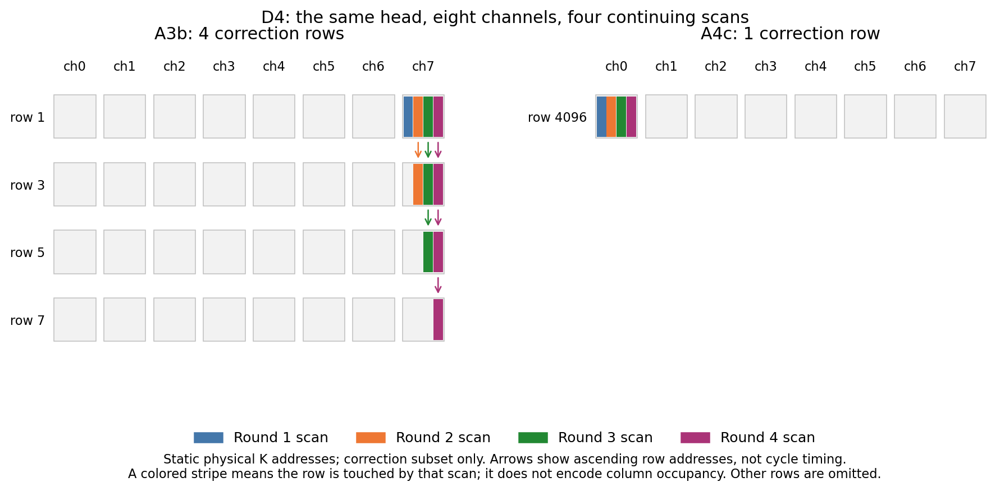
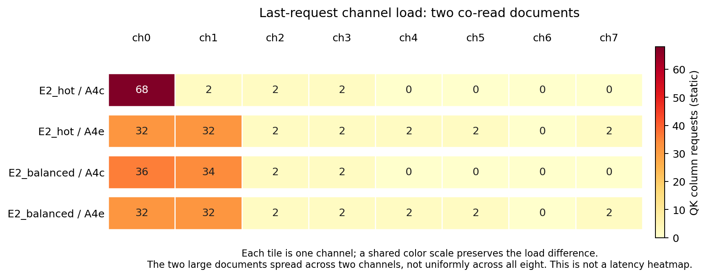

# 用最小 workload 检查：GPU 变快后，布局收益能否更多地进入 TBT

本指南供另一台机器执行。三个布局输入分别只有一个四轮汇总链、一个两轮热点共读链及其均衡对照；每个业务请求输出八个 token。先用真实地址证明布局改变了什么，再在同一份输入上比较 A100a 与更快 GPU 的 scan、TBT、TTFT 和 E2E。第 7 节另附一个 P4 小输入，用于 A4e–A6 的 TTFT、bank 吞吐及最终出图。

**2026-09-06 状态：输入构造、当前源码的复用计划/物理账本和 GPU 解析预算已经静态核验；没有运行这些输入的 Ramulator 或完整 DAG 性能仿真。** 本页所有行数、列请求数都不是实测延迟。

## 1. 先确认 GPU 名称与实验含义

chenyi9 提到 H200；本次检查的工作区实际支持 `A100a`、`H100`、`B200`，没有 `H200`。入口见 [main.py](../../main.py)，配置见 [src/config.py](../../src/config.py) 与 [src/type.py](../../src/type.py)。下面明确使用 **B200**；不能把 B200 结果标成 H200，也不能仅修改标签。

检查时 HEAD 为 `4260776`，B200 支持仍在工作区修改中。因此另一台机器仅 checkout 这个 commit 不够：需要同步包含 GPU 修改的同一份源码，并保留本页准备脚本生成的源码 hash。脚本发现没有 B200 时直接报错。另一台机器若已有真正的 H200 实现，须先重新核对其配置与静态预算，再建立单独的 H200 实验目录。

这是 CPU 上执行的性能模拟，执行机器本身不需要安装 B200。固定 LLAMA3-8B、单 GPU、五个 HBM3-PIM 栈；最忙栈有两个 KV head，每个 head 使用八个 channel。两种 GPU 使用同一 PIM 配置、NVLink3 计价、FlashAttention、pipeline、精度、k8 和 batch 上限。GPU 型号只在两个硬件对照组之间改变；每组内部各档硬件完全一致。

下面直接调用当前 `xPU.get_time_and_energy`，对 LLAMA3-8B 一层的 QKV、投影、FFN、归一化和激活服务时间求和。**它是当前解析模型的服务工作量，不是实测 GPU 延迟，也不是从 TBT 中扣掉 scan 后的剩余时间**；旋转、链路和调度还须从实际事件判断。

| GPU 配置 | 配置算力（dense TFLOPS） | 近端内存带宽（TB/s） | batch1 GPU 服务和（μs/层） | batch3 GPU 服务和（μs/层） |
|---|---:|---:|---:|---:|
| A100a | 312.0 | 3.352 | 182.367 | 187.558 |
| H100 | 989.4 | 3.352 | 180.020 | 180.236 |
| B200 | 2250.0 | 8.000 | 93.396 | 93.489 |

H100 的配置中，近端内存带宽与 A100a 相同；小 batch 的工作并不随峰值算力成倍加速。B200 的带宽提升在这组预算中确实使 GPU 工作明显缩短，但归一化、激活等项保留原有计价，不能用峰值 TFLOPS 比例整体缩放。新 GPU 仍复用已有 GEMM/FlashAttention 效率模型和 GPU energy 表，结果应称为该模型下的硬件敏感性实验，不能称为 H200/B200 真机校准结果。

## 2. 三个小例子与可以手算的内容

| 输入 | 请求总数（含 owner） | 全部输出 token | 观察请求 |
|---|---:|---:|---|
| D4_diff | 13 | 97 | `g00_s_t003` |
| E2_hot | 4 | 18 | `s00_t001` |
| E2_balanced | 4 | 18 | `s00_t001` |

### D4_diff：同轮合并公平，跨轮 diff 仍然分散

一个 owner 先导入八个 256-token 文档，带一个 256-token 前缀。三个持续 agent 运行四轮：汇总者每轮读取两个尚未读过的文档，加 16-token 指令；两个后台 agent 分别写两段、一段 16-token 私有笔记。所有业务请求都回答八个 token。汇总者每轮保留完整旧上下文及上一轮输出，所以旧 diff 有效，不会重新计算。

第 R 轮汇总者的 prompt 为 `16 + R×(2×256+16) + (R−1)×8`；每轮两个 chunk 各产生 k8 修正，累计 diff 为 `16R`。末轮 prompt、diff、计算量由下表自动给出。第一轮没有上一轮输出，后面三轮的原始八-token 输出按实际 parent 关系进入上下文。

A3b 每轮的两份修正本来就能合成一个 burst。稳定轮次的写入对象数是后台 A 的三个 master、后台 B 的两个 master、汇总者的两个 master 加一个 diff burst，正好一个八通道周期。实际账本确认跨轮 burst 落到同一通道的不同行；A4c 把这四轮修正紧接着放入独立区域。背景是所有档都执行的真实输入，周期是有意构造的机制例子，不代表随机写入的平均情况。

**这个输入不依赖半列追加。** 当前普通短输出仍按已有行分配规则存储；八-token 回答的作用是缩短模拟工作量。不能把它解释为已经建模了短输出挤偏后继 diff。

### E2_hot：只共读两个文档，就能看到通道热点

两位 owner 各导入八个单行文档，owner 没有额外前缀。一个汇总者共读全局编号 `0、8`，加 16-token 前缀和 16-token 问题，输出八个 token；下一轮保留这些内容，追加上一轮输出和 16-token 问题，再输出八个 token。

第一轮两个修正共 16 token；第二轮继承这 16 token，没有新 diff，实际新计算仅为新问题的 16 token。第二轮 prompt 的手算式是 `16 + 2×256 + 16 + 8 + 16`。

朴素 master 放置是 `channel = 全局 master block 序号 mod 8`。两个文档因此落到同一通道的不同行；当前 A4e 表把它们分别放到 ch0、ch1。它们使用同组 banks，原来必须先后访问两个 row，现在可由两个通道并行。这里是逐行扫描和通道负载差异，不声称存在反复来回抖动。

两组导入让软件表保留了“组内导入”和“跨组取两篇共读”的区别。不能随手改成一个 owner 导入全部文档：共读图会改变，已知可能失去这个例子的放置收益。未被汇总者选中的文档也真实导入并计入完整 E2E。

### E2_balanced：工作量相同的均衡对照

仅把 E2_hot 的共读选择改为 `0、1`；导入、请求数、长度、轮数和输出全部相同。朴素布局已把两个文档分在不同通道，因此软件表能节省的大块扫描明显变少。A4e 仍可能优化前缀、历史和 diff，所以这个对照**不要求收益严格为零**。

### 当前源码的地址核验结果

口径：末轮汇总请求完成 prefill 时的完整物理读集，layer0/head0；后续 decode 还会增加自己的生成 token。`K 行`只计 K 侧，V 侧地址也保存在原始 extents；行数不是 ACT 次数。`QK 列请求`按当前生成器的 16-token 取整规则计算，不是 QK+PV 总指令数。

| 输入/档 | 末轮 prompt / diff / 新计算 token | diff 的 K 行总数 | 完整读集 K 行 ch0…ch7 | 最忙通道 QK 列请求 |
|---|---|---:|---|---:|
| D4_diff / A3b | 2152 / 64 / 32 | 4 | 1,1,1,2,3,3,3,6 | 42 |
| D4_diff / A4c | 2152 / 64 / 32 | 1 | 2,1,1,2,3,3,3,2 | 40 |
| D4_diff / A4e | 2152 / 64 / 32 | 1 | 3,2,2,2,2,2,2,2 | 42 |
| E2_hot / A3b | 568 / 16 / 16 | 1 | 3,2,1,1,0,0,0,0 | 66 |
| E2_hot / A4c | 568 / 16 / 16 | 1 | 4,1,1,1,0,0,0,0 | 68 |
| E2_hot / A4e | 568 / 16 / 16 | 1 | 1,1,1,1,1,1,0,1 | 32 |
| E2_balanced / A3b | 568 / 16 / 16 | 1 | 2,3,1,1,0,0,0,0 | 36 |
| E2_balanced / A4c | 568 / 16 / 16 | 1 | 3,2,1,1,0,0,0,0 | 36 |
| E2_balanced / A4e | 568 / 16 / 16 | 1 | 1,1,1,1,1,1,0,1 | 32 |

三个例子所有档的逻辑 prompt、修正、新旧 diff、实际重算量与物理 token 读量都已核对相同。特别是 D4：总修正行收拢，并不等于最忙通道列工作同比下降；其 A4e 也不是所有静态指标都优于 A4c。这些差异原样保留，不为某档获得递增结果而改数据。

## 3. 预期：能检验 GPU 是否减少遮蔽，不能预先保证大幅 TBT 收益

在串行示意 `TBT = G + S` 中，G 是其他暴露在关键路径上的时间，S 是暴露的 scan 时间。若布局节省 ΔS，TBT 降幅为 `ΔS/(G+S)`。固定 S、ΔS 时，GPU 加速使 G 降低，TBT 的相对降幅会增大。

这是解释趋势的公式，不是当前流水调度器的精确公式。实际可能存在 GPU 与 PIM 重叠、通道排队及瓶颈转换。**不能用 `TBT − 32×平均 scan` 得到“非 scan 时间”，也不能把 GPU 服务时间和直接当作 G。**

三个最小输入的目标是看到真实方向和绝对时间差；短 KV 下，即使 B200 GPU 工作约减半，布局对 TBT 的影响仍可能很小。E2_hot 的主要文档扫描集中度改变较大，是优先观察 scan 向 TBT 传递的例子；D4 主要验证多轮合并机制，不能提前给出固定 speedup。所有结果保持原规模报告。

## 4. 在另一台机器准备输入与静态证据

在已经同步源码的仓库根目录执行。`FUGUE_MINI_ROOT` 选本机数据盘上的新目录；`ATTACC_RAMULATOR_DIR` 指向已准备好的二进制、trace_gen 与签名缓存目录。机器环境见 [squire](../run/README_run_squire.md) 或 [athena](../run/README_run_athena.md)。Ramulator 使用与本次源码配套的修改版本。

```bash
set -euo pipefail
cd /path/to/attacc_drampim_822
export FUGUE_MINI_ROOT=/path/to/data/minimal_layout_gpu_20260906
export ATTACC_RAMULATOR_DIR=/path/to/ramulator_scratch
export PYTHONDONTWRITEBYTECODE=1
export PYTHONPATH="$PWD"
export KVPIM_CPPCORE=1
test ! -e "$FUGUE_MINI_ROOT"
mkdir -p "$FUGUE_MINI_ROOT"
```

下面代码只生成输入、检查当前账本和计算 GPU 解析预算，不启动性能模拟。它调用 `targeted/build.py` 的构造函数和 `handcheck.py` 的 `describe`，**不执行那两个文件的 main**，因此不会重建大输入，也不会使用旧 commit 的账本快照。源文件 hash、完整 extents 和 GPU 分项保存在 `static.json`。

```bash
python3 - <<'PY'
import csv, hashlib, json, os, subprocess, sys
from pathlib import Path

repo = Path.cwd()
sys.path[:0] = [str(repo), str(repo / 'workload/probe/targeted')]
import build as b
import handcheck as h
import src.workload_runner as runner
from src.workload import load_workload, build_reuse_plan
from src.config import make_model_config, make_xpu_config, SCALING_FACTOR
from src.devices import xPU
from src.model import Transformer
from src.type import DataType, DeviceType, GPUType, LayerType

root = Path(os.environ['FUGUE_MINI_ROOT']).resolve()
inputs = root / 'inputs'
inputs.mkdir(parents=True, exist_ok=True)
assert hasattr(GPUType, 'B200'), 'This source has no B200 configuration; synchronize the intended source first.'

def diff_case():
    docs = [b.segment('mini-diff-doc-%d' % j, 256) for j in range(8)]
    agents = [b.request('a0_corpus', 0, [b.segment('mini-owner-prefix', 256, 'sys')] + docs, 1)]
    prior = {}
    for turn in range(4):
        for who, count in (('a', 2), ('b', 1), ('s', 1)):
            rid = 'g00_%s_t%03d' % (who, turn)
            additions = ([dict(x) for x in docs[2*turn:2*turn+2]] + [b.segment(rid+'-instruction', 16, 'user')]
                         if who == 's' else [b.segment(rid+'-note%d' % j, 16, 'user') for j in range(count)])
            req = b.advance(prior.get(who), [b.segment('mini-'+who+'-prefix', 16, 'sys')],
                            additions, rid, turn, 8)
            agents.append(req)
            prior[who] = req
    return {'meta': {'format': 'v2-dag', 'kind': 'four real turns with two corrections per turn', 'block_tokens': 256},
            'agents': agents}

cases = {
    'D4_diff': diff_case(),
    'E2_hot': b.retrieval(period=8, selected=2, workers=1, rounds=2, owner_group=8, own=16, lout=8, corpus_size=16),
    'E2_balanced': b.retrieval(period=1, selected=2, workers=1, rounds=2, owner_group=8, own=16, lout=8, corpus_size=16),
}
source_paths = ['main.py'] + [str(p) for d in ('src', 'pim_ramulator_src', 'workload/probe/targeted')
                             for p in sorted(Path(d).rglob('*')) if p.suffix in ('.py', '.cpp', '.h', '.hpp')]
hashes = {p: hashlib.sha256(Path(p).read_bytes()).hexdigest() for p in source_paths}
evidence = {'scope': 'Current-source static reuse/address checks and analytical GPU pricing; no Ramulator or DAG run',
            'git_rev': subprocess.check_output(['git', 'rev-parse', 'HEAD'], text=True).strip(),
            'source_sha256': hashes, 'cases': {}, 'gpu': {}}
manifest, table = [], []
for name, data in cases.items():
    path = inputs / (name+'.json')
    path.write_text(json.dumps(data, indent=1)+'\n')
    wl = load_workload(str(path))
    plan = build_reuse_plan(wl, 'recompute', epic_prefix_recompute_tokens=8)
    targets = [q for q in wl.requests if ('_s_t' in q.request_id if name.startswith('D') else q.request_id.startswith('s00_'))]
    variants = {rung: h.describe(runner, wl, plan, rung, targets) for rung in ('A3b', 'A4c', 'A4e')}
    fields = ('prompt_tokens', 'diff_tokens', 'new_diff_tokens', 'inherited_diff_tokens', 'physical_scan_tokens', 'compute_tokens', 'resident_tokens')
    for q in targets:
        for rung in ('A4c', 'A4e'):
            for field in fields:
                assert variants[rung][q.request_id][field] == variants['A3b'][q.request_id][field], (name, rung, q.request_id, field)
    last = targets[-1].request_id
    for rung in variants:
        v = variants[rung][last]
        row = {'case': name, 'rung': rung, 'request': last,
               'prompt_tokens': v['prompt_tokens'], 'diff_tokens': v['diff_tokens'],
               'new_diff_tokens': v['new_diff_tokens'], 'compute_tokens': v['compute_tokens'],
               'diff_K_rows': sum(x['physical_rows'] for x in v['diff'].values()),
               'full_K_rows_by_ch': [v['full'].get(c, {}).get('physical_rows', 0) for c in range(8)],
               'full_QK_by_ch': [v['full'].get(c, {}).get('qk_mac_requests', 0) for c in range(8)],
               'doc_K_rows_by_ch': [v['document_master'].get(c, {}).get('physical_rows', 0) for c in range(8)]}
        table.append(row)
    manifest.append({'file': path.name, 'axis': 'minimal_control', 'value': name,
                     'requests': len(data['agents']), 'decode_tokens': sum(q['lout'] for q in data['agents']),
                     'sha256': hashlib.sha256(path.read_bytes()).hexdigest()})
    evidence['cases'][name] = {'last_request': last, 'variants': variants}

for label in ('A100a', 'H100', 'B200'):
    config = make_xpu_config(getattr(GPUType, label), num_gpu=1, gpu_model='flash', pim_link_bw=600e9)['GPU']
    gpu = xPU(DeviceType.GPU, config, SCALING_FACTOR)
    by_batch = {}
    for batch in (1, 3):
        model = Transformer(make_model_config('LLAMA3-8B', DataType.W16A16), 1)
        model.build(batch, 1, 2, attn_on_hetero=True)
        layers = model.gen_decoder[0] if isinstance(model.gen_decoder[0], list) else model.gen_decoder
        parts = {op.name: gpu.get_time_and_energy(op)[0]*1e6 for op in layers
                 if op.type in (LayerType.FC, LayerType.ACT, LayerType.NORM)}
        by_batch[str(batch)] = {'parts_us': parts, 'sum_us_per_layer': sum(parts.values())}
    evidence['gpu'][label] = {'dense_TFLOPS_config': config['FLOPS_PER_DEVICE']/1e12,
                              'near_HBM_TBps_config': config['OFF_MEM_BW_PER_DEVICE']/1e12,
                              'pim_link_GBps_config': config['PIM_LINK_BW']/1e9,
                              'batches': by_batch}
evidence['compact'] = table
(root/'static.json').write_text(json.dumps(evidence, indent=2)+'\n')
with (inputs/'manifest.csv').open('w', newline='') as f:
    writer = csv.DictWriter(f, fieldnames=list(manifest[0])); writer.writeheader(); writer.writerows(manifest)
print(json.dumps({'manifest': manifest, 'static': table, 'gpu': evidence['gpu']}, indent=2))
PY
```

生成的三个 JSON、`inputs/manifest.csv`、`static.json` 和本指南要一起保留。本页静态表对应的关键源码 hash：

| 源文件 | SHA256 |
|---|---|
| `main.py` | `08e3c219fa28d2788ca48fe19901e5abd553d65f35f3b6e39bb4e24a4bf9c9d8` |
| `src/type.py` | `aece7a7009c136394b2115d5d59deea352521367ded0e029c2c94386c233126e` |
| `src/config.py` | `efad4744fcb5bfcec5d3f3b5ff0228c5ff14721e56b2c572add0ad799309f0f9` |
| `src/workload_runner.py` | `e620fcaba429870b86f0305efc97d2bef445c20a9fa28b62207f2ec7ae89e540` |
| `pim_ramulator_src/trace_gen/gen_trace_attacc_bank.py` | `e92eed2ad4e92376ae7fa9143ebabc878e68c5d28b5546b47d536915511310c0` |

另一机器准备后比较 `static.json` 的所有源码 hash；若版本有变化，先审阅新的地址表，不能把本页旧计数当作该版本已经通过核验。

## 5. 性能执行命令：三个输入、两个 GPU、对应的相邻档

最小执行矩阵：D4 跑 A3b/A4c；两个 E2 跑 A4c/A4e；各自对照 A100a/B200。总计十二次小运行，按档顺序执行。A3b/A4e 的跨档数值若另有需求，应在同一输入上补档，不能跨 D/E 输入拼接。

下面是交给执行机器的性能命令；本次文档会话没有执行它。默认保留 full events，用于把末轮相同 decode 位置上的 scan 与 GPU 服务时间对齐。所有输入都很小，仍按机器页的资源限制运行。直接 main.py 不会读取 `GPU_MODEL` 环境变量，所以下面明确传 `--gpu-model flash`。

```bash
set -euo pipefail
export FUGUE_GPU_SET="A100a B200"
test -x "$ATTACC_RAMULATOR_DIR/ramulator2"
test -d "$ATTACC_RAMULATOR_DIR/trace_gen"
python3 - <<'PY'
import hashlib, json, os
from pathlib import Path
data = json.loads((Path(os.environ['FUGUE_MINI_ROOT'])/'static.json').read_text())
for name, digest in data['source_sha256'].items():
    assert hashlib.sha256(Path(name).read_bytes()).hexdigest() == digest, ('Source changed since static check', name)
PY
for FUGUE_GPU in $FUGUE_GPU_SET; do
  for FUGUE_CASE in D4_diff E2_hot E2_balanced; do
    FUGUE_RUNGS="A4c A4e"
    if [ "$FUGUE_CASE" = D4_diff ]; then FUGUE_RUNGS="A3b A4c"; fi
    FUGUE_OUT="$FUGUE_MINI_ROOT/runs/$FUGUE_GPU/$FUGUE_CASE"
    mkdir -p "$FUGUE_OUT"
    for FUGUE_RUNG in $FUGUE_RUNGS; do
      test ! -e "$FUGUE_OUT/dag_${FUGUE_RUNG}.json"
      ATTACC_RAMULATOR_LOG="$FUGUE_OUT/ramulator_${FUGUE_RUNG}.log" \
      python3 main.py --system dgx-attacc --gpu "$FUGUE_GPU" --model LLAMA3-8B \
        --ngpu 1 --num-hbm 5 --pim-link nvlink3 --word 2 --powerlimit \
        --engine dag --pipeopt --gpu-model flash \
        --reuse recompute --epic-prefix-recompute-tokens 8 \
        --cacheblend-batch-size 8 --ramulator-workers 7 \
        --ablation "$FUGUE_RUNG" --workload "$FUGUE_MINI_ROOT/inputs/$FUGUE_CASE.json" \
        --workload-report "$FUGUE_OUT/dag_${FUGUE_RUNG}.json" \
        --workload-report-events full > "$FUGUE_OUT/dag_${FUGUE_RUNG}.log" 2>&1
    done
  done
done
```

保留相同 PIM 签名缓存可以节省重复 Ramulator 调用。缓存命中的价格仍须来自相同二进制/trace generator 的真实 Ramulator 结果；不要用历史手工校准的 `b1_levers.py` 价格替代。更快的模拟 GPU 缩短的是被模拟的时间，不意味着 CPU 仿真任务自身成倍加速；本指南主要靠短链、少请求、短输出和少档降低执行量。

## 6. 出表：同时看局部收益与完整 workload

布局归因以预先指定的**末轮汇总请求**为主，同时保留整份 workload 的指标，包含 owner 导入。在这些末轮的观测位置，D4 的实际 decode batch 为三个请求，E2 为一个请求；不能将该人数套到包含 owner 的初始轮。batch 上限八不表示实际有八个请求。

下面脚本读取实际完整报告，自动写 `metrics.csv`、`comparisons.csv`、`pim_invariance.csv`，不会生成模拟数据。需要十二份报告齐全；失败或缺报告时报错。末轮 TBT 使用 `end_s−first_token_s` 除以 `lout−1`；scan 和 GPU 样本也去掉第一个生成位置，覆盖相同的后续 decode 位置。

```bash
python3 - <<'PY'
import csv, hashlib, json, os, sys
from collections import defaultdict
from pathlib import Path
from types import SimpleNamespace
sys.path.insert(0, str(Path.cwd()))
from src.workload_runner import summarize_decode_scans

root = Path(os.environ['FUGUE_MINI_ROOT']).resolve()
static = json.loads((root/'static.json').read_text())
rows = []
expected = {'D4_diff': ('A3b', 'A4c'), 'E2_hot': ('A4c', 'A4e'), 'E2_balanced': ('A4c', 'A4e')}
for gpu in os.environ.get('FUGUE_GPU_SET', 'A100a B200').split():
    for name, rungs in expected.items():
        path = root/'inputs'/(name+'.json')
        workload = json.loads(path.read_text())
        reqs = {q['id']: q for q in workload['agents']}
        target = static['cases'][name]['last_request']
        for rung in rungs:
            directory = root/'runs'/gpu/name
            report_path = directory/('dag_'+rung+'.json')
            report = json.loads(report_path.read_text())
            config = report['run_config']
            assert config['workload_sha256'] == hashlib.sha256(path.read_bytes()).hexdigest()
            for key, value in {'gpu': gpu, 'model': 'LLAMA3-8B', 'gpu_model': 'flash', 'ngpu': 1, 'num_hbm': 5,
                               'pim_link': 'nvlink3', 'pipeopt': True, 'powerlimit': True, 'word': 2,
                               'engine': 'dag', 'reuse': 'recompute', 'epic_prefix_recompute_tokens': 8,
                               'cacheblend_batch_size': 8}.items():
                assert config[key] == value, (report_path, key, config[key], value)
            summary = report['summary']['requests']
            measured = summary[target]
            events = report.get('events')
            assert events, 'Full events required for matched last-request scan/GPU measurements'
            target_events = []
            for event in events:
                if not event['name'].startswith('decode_'):
                    continue
                members = event.get('batch_members') or [event['request']]
                if target not in members:
                    continue
                positions = event.get('query_positions', [])
                assert positions, ('Missing decode position', event['id'])
                pos = positions[members.index(target)] if len(positions) == len(members) else positions[0]
                target_events.append((event, pos))
            positions = sorted({pos for _, pos in target_events})
            assert len(positions) == reqs[target]['lout'], (target, positions)
            # TBT is end-first token over lout-1 intervals. Drop the first
            # generated position from the scan/GPU sample as well.
            selected = set(positions[1:])
            scan_events, gpu_bins, signatures = [], defaultdict(float), []
            for event, pos in target_events:
                if pos not in selected:
                    continue
                if event['device'] == 'GPU':
                    gpu_bins[(event['transformer_layer'], pos)] += event['time_s']
                if 'pim_kv_scan' in event['name']:
                    scan_events.append(SimpleNamespace(request_id=event['request'], transformer_layer=event['transformer_layer'],
                        name=event['name'], query_positions=(pos,), batch_members=(), time_s=event['time_s'],
                        start_s=event['start_s'], end_s=event['end_s']))
                    signatures.append([event['transformer_layer'], event['name'], pos, event['device'],
                                       event['rows'], event['dram_addresses'], event['time_s']])
            assert scan_events and gpu_bins
            # Exact PIM service/address invariance across GPU configs is
            # checked separately for each fixed workload and rung.
            raw = json.dumps(sorted(signatures, key=lambda x: json.dumps(x)), separators=(',', ':')).encode()
            scan = summarize_decode_scans(scan_events)
            intervals = sum(q['lout']-1 for q in reqs.values() if q['lout']>1)
            span = sum(summary[rid]['end_s']-summary[rid]['first_token_s'] for rid,q in reqs.items() if q['lout']>1)
            rows.append({'gpu': gpu, 'case': name, 'rung': rung, 'request': target,
                'last_tbt_us': (measured['end_s']-measured['first_token_s'])/(reqs[target]['lout']-1)*1e6,
                'last_ttft_us': measured['ttft_s']*1e6,
                'all_tbt_us': span/intervals*1e6,
                'all_ttft_us': sum(x['ttft_s'] for x in summary.values())/len(summary)*1e6,
                'full_e2e_s': report['makespan_s'],
                'last_scan_service_us_per_scan': scan['private_service']['mean_us'],
                'last_scan_elapsed_us_per_layer_step': scan['per_step_elapsed']['mean_us'],
                'last_gpu_service_us_per_layer_step': sum(gpu_bins.values())/len(gpu_bins)*1e6,
                'corrected_rows_sha': report['corrected_rows_sha'],
                'pim_service_address_sha': hashlib.sha256(raw).hexdigest()})

comparisons = []
for gpu in os.environ.get('FUGUE_GPU_SET', 'A100a B200').split():
    for name, (old, new) in expected.items():
        a,b = [next(x for x in rows if (x['gpu'],x['case'],x['rung'])==(gpu,name,rung)) for rung in (old,new)]
        assert a['corrected_rows_sha'] == b['corrected_rows_sha'], (gpu,name,'different corrections')
        gain = lambda key: 1-b[key]/a[key] if a[key] else None
        scan_gain = gain('last_scan_service_us_per_scan')
        comparisons.append({'gpu':gpu,'case':name,'comparison':old+'->'+new,
                            'scan_service_reduction':scan_gain, 'tbt_reduction':gain('last_tbt_us'),
                            'tbt_to_scan_reduction_ratio':gain('last_tbt_us')/scan_gain if scan_gain is not None and scan_gain>0 else None})
checks = []
for name,rungs in expected.items():
    for rung in rungs:
        pair = [x for x in rows if x['case']==name and x['rung']==rung]
        checks.append({'case':name,'rung':rung,
                       'same_pim_service_addresses_across_gpus':len({x['pim_service_address_sha'] for x in pair})==1})
for filename,data in [('metrics.csv',rows), ('comparisons.csv',comparisons), ('pim_invariance.csv',checks)]:
    with (root/filename).open('w',newline='') as f:
        writer=csv.DictWriter(f,fieldnames=list(data[0]));writer.writeheader();writer.writerows(data)
    print(root/filename)
PY
```

读表顺序如下：

1. 检查 `pim_invariance.csv`：固定输入和档位，只换 GPU，末轮 PIM 扫描的地址、token 数和服务时间应保持一致。若出现 false，检查分组或 trace 身份变化，不能直接归因为 GPU 加速。不同 GPU 的扫描开始时刻和 elapsed 可以变化。
2. 在 `metrics.csv` 比较 A100a/B200 的 `last_gpu_service_us_per_layer_step`。它对服务目标请求的 GPU 事件只计一次；D4 共享 batch 的 GPU 事件包含整个三请求 batch 工作，没有人为除以三。它仍然是服务工作量，不是关键路径非 scan 延迟。
3. 同一 GPU 内比较相邻档的 `last_scan_service_us_per_scan` 与 `last_tbt_us`，再比较这两个降幅在 A100a/B200 上是否不同。scan service 先对一次 scan 的 channel 取最长时间，再对匹配样本求均值；不是 channel 时间平均。
4. `last_scan_elapsed_us_per_layer_step` 另外保留排队/调度跨度。`comparisons.csv` 的 `tbt_to_scan_reduction_ratio` 是两个相对降幅的比值，只有 scan 正收益时才计算；它不是严格的因果时间占比，也不能声称必在 0 到 1 之间。
5. 保留 `last_ttft_us`、`all_ttft_us`、`all_tbt_us` 与 `full_e2e_s`。局部 TBT 改善不能代替包含导入的 E2E；两个 E2 对照之间的变化也不能冒充某档的加速比。

最终应交回输入、static.json、全部 dag/log、三个 CSV 与源码身份。允许的结论是“在固定 PIM 与链路的模型中，GPU 工作减少后，某布局的相对 TBT 降幅增加/没有明显增加”，配绝对时间；不要把行数降幅、QK 列请求降幅或 B200 的峰值算力比例写成实测 TBT 降幅。

## 7. 最后怎么画图：路径、热点、scan/TBT、TTFT/bank 吞吐

chenyi9 决策：用小例子结合数据解释，不扩大 workload 来填图。图分成下面四个面板，数据与运行矩阵保持对应。统一用 PDF/SVG 矢量图，PNG 供预览，旁边保留 CSV 原始数据。

| 面板 | 画法与要回答的问题 | 数据来源 |
|---|---|---|
| 扫描路径 | 每列一个 channel，每个小长方形是该 channel 的一个 DRAM row；一次请求/轮次的扫描用一种颜色，展示跨行访问如何集中 | D4 的真实物理账本，按扫描身份导出访问行 |
| 通道热点 | 一条横带分成若干格，每格一个 channel；颜色深浅表示该通道的工作量，比较放置前后的集中程度 | E2 完整物理读集的 QK 列请求数；若改画服务时间，须改用实际报告的逐 channel Ramulator 时间 |
| scan 与 TBT | 同一个末轮请求、同一组生成位置，分别给 scan 和 TBT 的绝对时延，配降幅 | 原指南 `metrics.csv`、`comparisons.csv`，A100a/B200 分组 |
| A4e/A5/A6 | 给冷导入、首次复用和后续 q4 的 TTFT；另给相同 decode 工作的 bank 内有效吞吐 | 本节 P4 的三档完整报告及 A6 逐请求选边日志 |

**几何必须如实标注。** chenyi9 的四列例子是“四个 channel/head”时的画法；本指南真实运行是八个 channel/head，因此当前数据图画八列。横带的“列”是画布中的 channel 格子，不是 DRAM column。不能把八通道数据合并成四通道再沿用原性能数字。

**颜色不能改变数据含义。** 路径图使用离散颜色区分扫描，不表示热度。同一行被多轮扫描访问时，在一个 row 格内用固定位置的多条色带显示；这些色带不表示存储列的位置，也不表示整行都被扫描。路径箭头只连接同一 channel 上所选 diff 子集的递增物理行地址，不代表不同 channel 被串行访问，也不是 Ramulator 的逐周期命令顺序。

热点图使用统一的连续色标，A4c/A4e 和热点/均衡对照共用同一个最大值，不各自归一化。当前 E2 只有两个大文档，所以实际收益是从一个热点通道分到两个通道；不会把所有通道涂成一样来表现“完全均匀”。图中小块历史、前缀和 diff 的负载也保留。

### 已根据静态数据画出的两张结构图



[PDF](minimal_layout_figures/scan_paths.pdf)、[SVG](minimal_layout_figures/scan_paths.svg)、[扫描身份与地址 CSV](minimal_layout_figures/scan_paths.csv)。这里只放大 diff 子集；主文档和其他行省略，并明确标在图注。每个面板显示真实行号，行间空白不按地址距离或时间比例绘制。



[PDF](minimal_layout_figures/channel_hotspots.pdf)、[SVG](minimal_layout_figures/channel_hotspots.svg)、[逐通道原始计数 CSV](minimal_layout_figures/channel_hotspots.csv)。这是静态列请求负载图，不是已测得的 latency 热点图。源码/输入/绘图脚本身份见 [provenance.json](minimal_layout_figures/provenance.json)。

### 为 A4e–A6 增加一个 P4 小例子

只导入一个单行文档，然后让同一个汇总者复用它两轮；每轮追加四-token 问题，输出八个 token。首轮仍需处理前缀和 k8 修正，下一轮的历史与 diff 都继承，实际新计算才是 q4。它与 k4 无关，recompute k 保持八。

输入包含冷导入、首次复用、后续低-query 请求，因此同一个小输入就能比较固定 GPU、固定 PIM 和 A6 选边。是否真有请求选 PIM，必须读实际 side log；不能为了分开 A5/A6 手动改选边或降低链路带宽。所有请求，包括导入，都计入完整 E2E。

在原准备环境下执行下段，只生成 P4 并静态核对，不启动性能模拟：

```bash
python3 - <<'PY'
import hashlib, json, os, sys
from pathlib import Path
sys.path[:0] = [str(Path.cwd()), str(Path('workload/probe/targeted').resolve())]
import build as b
import handcheck as h
import src.workload_runner as runner
from src.workload import load_workload, build_reuse_plan
from src.ablation import resolve_config
root = Path(os.environ['FUGUE_MINI_ROOT'])
data = b.retrieval(period=1, selected=1, workers=1, rounds=2,
                   owner_group=1, own=4, lout=8, corpus_size=1)
path = root/'inputs/P4_reuse.json'
path.write_text(json.dumps(data, indent=1)+'\n')
wl = load_workload(str(path))
plan = build_reuse_plan(wl, 'recompute', epic_prefix_recompute_tokens=8)
info = h.describe(runner, wl, plan, 'A4e', list(wl.requests))
assert info['s00_t001']['compute_tokens'] == 4
assert info['s00_t001']['new_diff_tokens'] == 0
configs = {r: resolve_config(r,None,None,None,policy='recompute').to_dict() for r in ('A4e','A5','A6')}
evidence = {'scope':'Static plan and preset configuration; no PIM timing',
            'input_sha256':hashlib.sha256(path.read_bytes()).hexdigest(),
            'requests':len(data['agents']), 'decode_tokens':sum(q['lout'] for q in data['agents']),
            'plan':info, 'configs':configs}
(root/'P4_static.json').write_text(json.dumps(evidence,indent=2)+'\n')
print(json.dumps({r:{k:v[k] for k in ('prompt_tokens','compute_tokens','diff_tokens','new_diff_tokens')} for r,v in info.items()},indent=2))
PY
```

静态检查结果（自动读取生成结果）：3 个请求，全部输出 17 token。

| 请求 | prompt token | 实际新计算 token | 累计 diff | 本轮新 diff |
|---|---:|---:|---:|---:|
| `a_owner0000` | 256 | 256 | 0 | 0 |
| `s00_t000` | 276 | 28 | 8 | 8 |
| `s00_t001` | 288 | 4 | 8 | 0 |

| 档位 | bank 命令 | PE 频率配置（GHz） | 相对 A4e 的频率比例 |
|---|---|---:|---:|
| A4e | replicate | 0.666 | 1.000 |
| A5 | mq | 1.3004 | 1.953 |
| A6 | mq | 1.3004 | 1.953 |

下面是执行机器的三档性能命令，GPU 固定 B200。它补充原矩阵，不修改 D4/E2 的输入或原出表脚本。P4 保持 full events，以恢复 bank 侧 sweep 的实际服务时间。

```bash
set -euo pipefail
FUGUE_OUT="$FUGUE_MINI_ROOT/prefill_runs/B200/P4_reuse"
mkdir -p "$FUGUE_OUT"
for FUGUE_RUNG in A4e A5 A6; do
  test ! -e "$FUGUE_OUT/dag_${FUGUE_RUNG}.json"
  test ! -e "$FUGUE_OUT/sides_${FUGUE_RUNG}.jsonl"
  KVPIM_PREFILL_SIDE_LOG="$FUGUE_OUT/sides_${FUGUE_RUNG}.jsonl" \
  ATTACC_RAMULATOR_LOG="$FUGUE_OUT/ramulator_${FUGUE_RUNG}.log" \
  python3 main.py --system dgx-attacc --gpu B200 --model LLAMA3-8B \
    --ngpu 1 --num-hbm 5 --pim-link nvlink3 --word 2 --powerlimit \
    --engine dag --pipeopt --gpu-model flash \
    --reuse recompute --epic-prefix-recompute-tokens 8 \
    --cacheblend-batch-size 8 --ramulator-workers 7 \
    --ablation "$FUGUE_RUNG" --workload "$FUGUE_MINI_ROOT/inputs/P4_reuse.json" \
    --workload-report "$FUGUE_OUT/dag_${FUGUE_RUNG}.json" \
    --workload-report-events full > "$FUGUE_OUT/dag_${FUGUE_RUNG}.log" 2>&1
done
```

### “bank 内算力提升”怎么报才准确

分开列出配置与实际有效吞吐：

- 配置：A4e 的 replicate 与 A5/A6 的 MQ，以及各自 PE 频率。它们来自 preset；频率比例只是配置变化，不是实测的 attention 加速倍数。A5 与 A6 的 bank 配置相同，不能声称 A6 又提高了硬件峰值算力。
- 实际吞吐：用同一末轮 decode 工作，在 A4e/A5/A6 下计算 **bank 侧有效 QK+PV GFLOP/s**。这里所有档都确实在 PIM 执行 decode，能给出有意义的 A5/A4e、A6/A4e 比值。
- Prefill 的 bank 有效吞吐另外保存在 CSV。A4e prefill 在 GPU 上，bank-prefill 吞吐标为 N/A，不填零、不把相对它的提升写成无穷倍。A6 若为该请求选 GPU，同样标 N/A；TTFT 仍按真实完成时间报告。

对单 GPU 的全部 PIM 栈，QK+PV 有效运算数为 `4 × H_Q × d_head × Σ(q+1)`；q 是当前请求中从零开始的绝对 query 位置，因果注意力只把 `0…q` 算作有效工作，每个 MAC 按乘加两个运算计数。`H_Q` 已包含 GQA 的全部 Q head，不能再乘一次 GQA。被遮蔽的 master、padding 和因果上三角仍可能花时间，但不增加有效运算数。

服务时间对每个 sweep 取 `max(channel time_s)`，再按该请求各层的 sweep 求和，不能把并行 channel 时间相加。分子也累计相同层、相同 query，避免层数或 head 数多乘。扫描服务包含 QK、softmax 和 PV；因此此处是以有用 QK+PV 工作计量的 **bank attention 有效吞吐**，不是纯 MAC 阵列峰值，也不是整机端到端 FLOP/s。

`sides_A6.jsonl` 的 `t_bank_s` 包含选边模型中的 context 返回等项，不能直接当作纯 bank 计算时间。TTFT 应包含排队、GPU 运算与链路；选边收益与 bank 吞吐收益分别解释。

### 自动出图

运行完原矩阵后先执行第 6 节出表；P4 直接读原始报告。使用同一条绘图命令：

```bash
MPLCONFIGDIR="$FUGUE_MINI_ROOT/matplotlib" \
python3 docs/experiments/plot_minimal_layout.py "$FUGUE_MINI_ROOT" \
  --out "$FUGUE_MINI_ROOT/figures"
```

[绘图脚本](plot_minimal_layout.py) 不调用 Ramulator 或 DAG：它重画两张静态结构图；有 `metrics.csv` 时才画 `scan_and_tbt`，有齐全的 P4 报告时才画 `ttft_and_bank_throughput`，同时输出 `prefill_bank.csv`。每图保存 PDF/SVG/PNG。没有性能数据时不会用占行数、假设时间或空柱补出性能图。

TTFT 的冷导入、首次复用、后续 q4 各用一个小面板，保留各自绝对 μs，避免冷导入的大值把短请求差异压没。bank 吞吐柱上标相对 A4e 的倍数，CSV 同时保留绝对 GFLOP/s、`bank_decode_speedup_vs_A4e` 和每请求的 `ttft_reduction_vs_A4e`。A5/A6 若在相同工作上的 bank 服务一样，图上就应相同。

当前已经生成的是上面的两张静态结构图。scan/TBT、TTFT 和实际 bank 吞吐图须等执行机器返回真实报告；分析时保留零收益、负收益和不完全均衡的结果，不以画面是否“漂亮”决定保留哪个 case。
